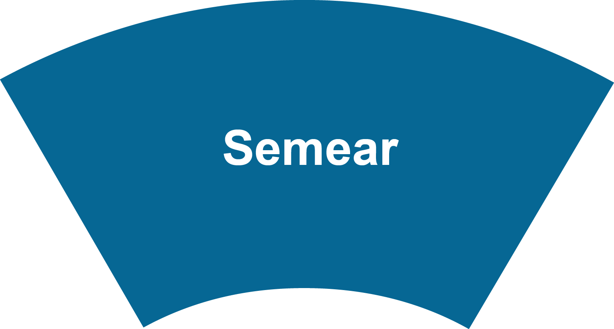
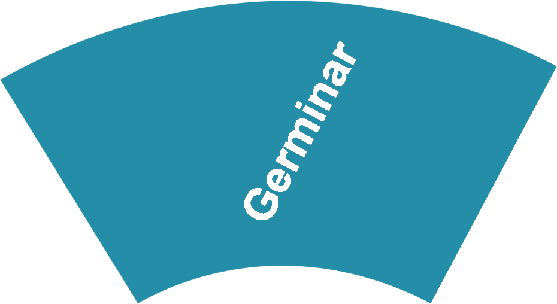

# Calliandra

A Calliandra é uma abordagem ágil de cocriação para o desenvolvimento de serviços públicos digitais, criada pelo Laboratório ITRAC da Universidade de Brasília. Inspirada em práticas de design de serviços e metodologias ágeis, a Calliandra busca transformar a maneira como os serviços digitais são concebidos e implementados no setor público. A abordagem é baseada em um ciclo de vida semelhante ao de uma planta, com fases que vão desde a ideação até a melhoria contínua, envolvendo diretamente usuários, desenvolvedores, gestores e outros stakeholders no processo de criação.

## Objetivo geral da Calliandra

O objetivo da Calliandra é promover a transformação digital dos serviços públicos, criando soluções inovadoras, eficientes e centradas no usuário. A abordagem visa facilitar o desenvolvimento de serviços digitais que atendam às necessidades dos cidadãos de maneira ágil e colaborativa, contribuindo para a inclusão digital e o alcance dos Objetivos de Desenvolvimento Sustentável (ODS). Ao aplicar métodos de cocriação e design centrado na vida, a Calliandra busca garantir que os serviços públicos digitais sejam intuitivos, acessíveis e capazes de gerar valor para a sociedade.

## Principios Fundamentais
A abordagem Calliandra é guiada por cinco princípios fundamentais:

- **Design Centrado na Vida:** O usuário está no centro de todas as decisões de design. Além de atender às necessidades diretas dos cidadãos, a abordagem considera o impacto social, econômico e ambiental dos serviços desenvolvidos.

- **Cocriação e Colaboração:** Todos os stakeholders (cidadãos, desenvolvedores, designers, gestores públicos) são envolvidos no processo de criação dos serviços. Isso garante que diferentes perspectivas sejam consideradas, aumentando a qualidade e a relevância dos serviços finais.

- **Sustentabilidade e Inclusão:** A Calliandra promove a criação de serviços acessíveis a todos os cidadãos, independentemente de suas condições sociais, econômicas ou regionais, garantindo inclusão digital e respeito ao meio ambiente.

- **Metodologias Ágeis:** A abordagem utiliza métodos ágeis, como Scrum e Lean Startup, para permitir flexibilidade, adaptação rápida às mudanças e um desenvolvimento contínuo e iterativo dos serviços digitais.

- **Alinhamento com os Objetivos de Desenvolvimento Sustentável (ODS):** Cada projeto desenvolvido pela Calliandra é projetado para contribuir com metas específicas dos ODS, como a redução das desigualdades e a promoção de instituições eficazes e transparentes.

<h6 align="center">Imagem 1 - Abordagem Calliandra.</h6>

## Fases da Abordagem Calliandra

<h6 align="center">Imagem 2 - Fases da Abordagem Calliandra.</h6>

## <a style="color: #1a73e8; font-weight: 500;" href="...">Semear</a>

    

        <h4 style="margin: 0; color: #5f6368; font-weight: 400;">Semear</h4>
        
 Identificação do serviço a ser criado e do público-alvo, começando com uma ideia inovadora e pesquisas para alimentá-la.

         
        <a style="margin: 0; color: #1a73e8; font-weight: 500;" href="...">Veja mais</a>
    

--------------------------------------------------------
## <a style="color: #1a73e8; font-weight: 500;" href="...">Geminar</a>

    

        <h4 style="margin: 0; color: #5f6368; font-weight: 400;">Geminar</h4>
        
 Delimitação do escopo do serviço, refinando a ideia inicial com base nas necessidades e problemas identificados junto ao usuário.

         
        <a style="margin: 0; color: #1a73e8; font-weight: 500;" href="...">Veja mais</a>
    

---------------------------------------------------------
## <a style="color: #1a73e8; font-weight: 500;" href="...">Brotar</a>

    

        <h4 style="margin: 0; color: #5f6368; font-weight: 400;">Brotar</h4>
        
  Configuração inicial do serviço, definindo funcionalidades e soluções tecnológicas.

         
        <a style="margin: 0; color: #1a73e8; font-weight: 500;" href="...">Veja mais</a>
    

----------------------------------------------------------------
## <a style="color: #1a73e8; font-weight: 500;" href="...">Florescer</a>

    

        <h4 style="margin: 0; color: #5f6368; font-weight: 400;">Florescer</h4>
        
 Desenvolvimento efetivo da solução, utilizando práticas de UX-Ágeis em paralelo ao desenvolvimento de software.

         
        <a style="margin: 0; color: #1a73e8; font-weight: 500;" href="...">Veja mais</a>
    

----------------------------------------------------------
## <a style="color: #1a73e8; font-weight: 500;" href="...">Frutificar</a>

    

        <h4 style="margin: 0; color: #5f6368; font-weight: 400;">Frutificar</h4>
        
 Monitoramento e otimização para garantir que os objetivos estão sendo alcançados após o lançamento do serviço.

         
        <a style="margin: 0; color: #1a73e8; font-weight: 500;" href="...">Veja mais</a>
    

--------------------------------------------------------
## <a style="color: #1a73e8; font-weight: 500;" href="...">Amadurecer</a>

    

        <h4 style="margin: 0; color: #5f6368; font-weight: 400;"> Amadurecer </h4>
        
  Melhoria contínua do serviço, coletando insights e conhecimentos para refinamento do processo.

         
        <a style="margin: 0; color: #1a73e8; font-weight: 500;" href="...">Veja mais</a>
    

-------------------------------------------------------------

  <!-- Imagem central -->
  
  
  <!-- Partes ao redor do círculo, no sentido horário -->
  
  
  
  
  
  

