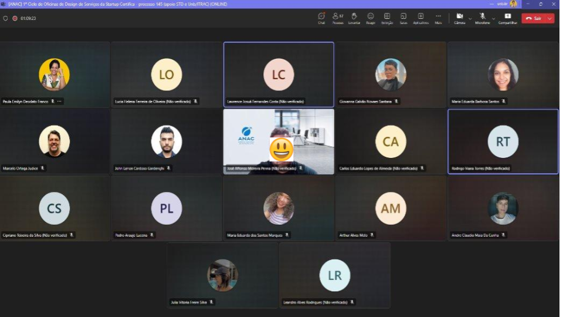
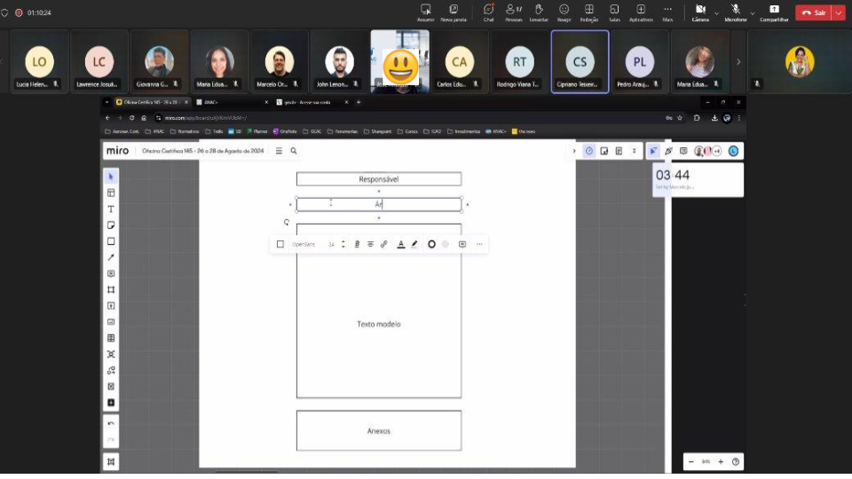

# Oficina Certifica 145

    <!-- Coluna da pergunta -->
    

        
        
A oficina gerou um compromisso claro para a continuidade do trabalho, com a necessidade de mais discussões internas e refinamentos antes da implementação final do sistema.

    

    <!-- Coluna de estatísticas e métodos -->
    

        

            

                <h3 style="font-size: 16px; color: #666;">ESTATÍSTICAS</h3>
                
Tamanho da equipe

                
10 participantes

                
Nº de dias

                
3 dias

            

            

                <h3 style="font-size: 16px; color: #666;">MÉTODOS USADOS</h3>
                    <ul style="list-style-type: none; padding: 0; margin: 0;">
                        <li><a href="#" style="color: #1a73e8; text-decoration: none;">Quebra-Gelo</a></li>
                        <li><a href="#" style="color: #1a73e8; text-decoration: none;">Enunciação do Problema​</a></li>
                        <li><a href="#" style="color: #1a73e8; text-decoration: none;">Personas</a></li>
                        <li><a href="#" style="color: #1a73e8; text-decoration: none;">Jornada do Usuário</a></li>
                        <li><a href="#" style="color: #1a73e8; text-decoration: none;">É, não é, Faz, Não Faz</a></li>
                        <li><a href="#" style="color: #1a73e8; text-decoration: none;">Benchmarking</a></li>
                        <li><a href="#" style="color: #1a73e8; text-decoration: none;">Crazy 8</a></li>
                        <li><a href="#" style="color: #1a73e8; text-decoration: none;">Storyboarding</a></li>
                        <li><a href="#" style="color: #1a73e8; text-decoration: none;">Protótipo</a></li>
                        <li><a href="#" style="color: #1a73e8; text-decoration: none;">Teste</a></li>
                    </ul>
            

        

    

## O Desafio

Foi desenvolvido a Oficina de Design do Serviço específica para a Certifica 145​ da Agência Nacional de Aviação Civil (ANAC) que tem como ideia Identificar problemas, jornadas e priorização de processos do Certifica 145 além de prototipa-lo.​

A startup "Certifica" é um projeto focado na transformação digital, criado em parceria com a Superintendência e a STD, para melhorar os processos internos e a experiência do usuário na ANAC.​ A "Certifica" é voltada especificamente para os processos de certificação nos âmbitos do RBAC 135, 145, 91 e possivelmente 121.​

No contexto da Certifica 145, foi discutida a aplicação de diferentes metodologias de design de serviço. Embora o Design Sprint seja amplamente reconhecido por sua estrutura robusta e eficácia na solução rápida de problemas, a abordagem adotada na oficina da ANAC destacou-se como uma oficina de co-design, onde a participação ativa dos envolvidos foi fundamental para o desenvolvimento de protótipos. Essa metodologia permitiu uma maior interação entre os participantes, garantindo que os protótipos criados refletissem de forma precisa as necessidades e expectativas de todos os envolvidos.​

## A equipe

A oficina foi conduzida pelo facilitador, o professor Marcelo, junto com o colaborador Oto Lima e os integrantes do ITRAC que ajudaram auxiliando na oficina e na criação do relatório final no qual registra tudo o que aconteceu além dos resultados. Também teve no total 10 participantes, cujo estes fazem parte da ANAC. Na Imagem 1 demonstra os participantes reunidos de forma online pela plataforma teams. 

<b>Imagem 1 - </b> Participantes da Oficina online.

<b>Fonte: </b>Relatório Oficinas Certifica 145. 2024.

## A oficina

Esta oficina com a Certifica foi a segunda realizada, mas desta vez de forma online, utilizando o Teams para comunicação e o Miro para interação e execução das metodologias. Com a experiência prévia dos participantes em oficinas, o evento se desenrolou ao longo de três dias, na data 26/08 até 28/08 de 2024, focando na prototipagem e na realização de testes. Na Imagem 2 representa o desenvolvimento do esboço que posteriormente foi usado como base para criar o protótipo.

<b>Imagem 2 - </b> prototipagem da oficina.

<b>Fonte: </b>Relatório Oficinas Certifica 145. 2024.

Os testes revelaram pontos positivos, como a clara organização das telas e a facilidade de uso para usuários experientes, além de destacar áreas para melhoria. Entre os pontos negativos, foram mencionados a complexidade e os termos técnicos que dificultavam a compreensão para usuários menos experientes, e a simplicidade excessiva da interface que compromete a compreensão das funcionalidades. As sugestões para melhorias incluíram a adição de indicadores visuais e tutoriais passo a passo, bem como a necessidade de testar o protótipo com usuários sem experiência técnica para assegurar a acessibilidade para todos.

## Destaques da oficina

[timeline center alternate(./docs/timeline/certifica-Time-Line.json)]

## O resultado

A oficina resultou na criação de um protótipo preliminar do sistema de certificação 145, que, embora ainda em fase inicial, já incorpora sugestões e feedbacks dos participantes. Este protótipo serve como base para futuras iterações e refinamentos.

A oficina permitiu uma identificação clara das principais dores e desafios enfrentados pelos regulados no processo de certificação. Isso incluiu questões como a imprevisibilidade nos prazos, a dependência de consultorias externas e a complexidade dos procedimentos exigidos.

Foram propostas soluções, como a simplificação do sistema, a customização de procedimentos e a implementação de funcionalidades inspiradas em outros sistemas conhecidos, como o de declaração de imposto de renda.

A oficina foi bem-sucedida em alinhar as expectativas entre regulados e reguladores, com a equipe da UnB desempenhando um papel crucial em conduzir discussões focadas no usuário. Houve uma colaboração efetiva entre os participantes, o que resultou em um protótipo que reflete as reais necessidades do mercado.

Os participantes foram engajados de maneira significativa, garantindo que suas vozes fossem ouvidas e suas necessidades fossem consideradas no desenvolvimento do sistema. A interação direta com o protótipo permitiu que os usuários identificassem pontos de melhoria e sugerissem ajustes, tornando o sistema mais intuitivo e funcional.

Esses resultados refletem o progresso significativo alcançado durante a oficina, estabelecendo uma base sólida para o desenvolvimento de um sistema de certificação mais eficiente e centrado no usuário. Foi reconhecida a importância de manter um diálogo contínuo com os usuários para ajustar e melhorar o sistema ao longo do tempo, garantindo que ele atenda às necessidades do mercado.
