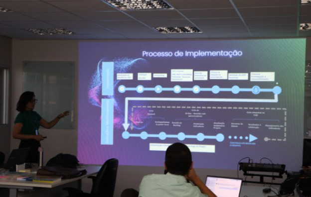
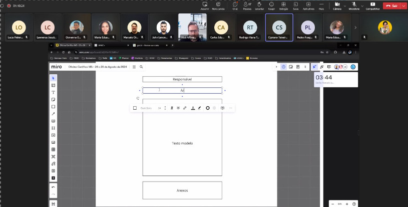

# Oficinas para qualquer desafio

A metodologia de oficinas de Design de Serviço pode ser aplicada para enfrentar diversos desafios dentro do contexto de transformação digital. Mais do que acelerar a inovação no desenvolvimento de produtos, essas oficinas são essenciais para repensar processos, otimizar a experiência do usuário, criar novas abordagens para serviços digitais e até mesmo redefinir a visão e o impacto de uma organização no mundo digital.

## <a style="color: #1a73e8; font-weight: 500;" href="../case-studies/diario-bordo">Diário de Bordo Digital</a>

    
    

        <h4 style="margin: 0; color: #5f6368; font-weight: 400;">DESIGN DE SERVIÇO</h4>
        
A oficina de Design de Serviço para o Diário de Bordo Digital da ANAC buscou identificar barreiras no uso do sistema e propor soluções. O resultado foi a criação de um roadmap e um MVP para melhorar a adesão ao serviço.

         
        <a style="margin: 0; color: #1a73e8; font-weight: 500;" href="../case-studies/diario-bordo">Veja mais</a>
    

--------------------------------------------------------
## <a style="color: #1a73e8; font-weight: 500;" href="../case-studies/hub-financeiro">HUB Financeiro</a>

    
    

        <h4 style="margin: 0; color: #5f6368; font-weight: 400;">DESIGN DE SERVIÇO</h4>
        
A oficina de Design de Serviço para o HUB Financeiro da ANAC buscou validar o ecossistema do hub e redesenhar serviços com foco no usuário. O resultado foi a criação de um protótipo e um roadmap para melhorar a qualidade do serviço.

         
        <a style="margin: 0; color: #1a73e8; font-weight: 500;" href="../case-studies/hub-financeiro">Veja mais</a>
    

---------------------------------------------------------
## <a style="color: #1a73e8; font-weight: 500;" href="../case-studies/anac-decea">ANAC e DECEA</a>

    
    

        <h4 style="margin: 0; color: #5f6368; font-weight: 400;">DESIGN DE SERVIÇO</h4>
        
A oficina de Design de Serviço para a Integração ANAC e DECEA teve como objetivo principal a elaboração de um roadmap de integração entre as duas instituições. O resultado foi a identificação de serviços e dados prioritários para futuras integrações e a criação de um roadmap detalhado para guiar as ações de médio e longo prazo​.

         
        <a style="margin: 0; color: #1a73e8; font-weight: 500;" href="../case-studies/anac-decea">Veja mais</a>
    

----------------------------------------------------------------
## <a style="color: #1a73e8; font-weight: 500;" href="../case-studies/safety-Intelligence">Safety intelligence</a>

    
    

        <h4 style="margin: 0; color: #5f6368; font-weight: 400;">Safety Intelligence</h4>
        
A oficina de Lean Inception para o projeto Safety Intelligence da ANAC focou na definição dos objetivos da startup e na elaboração de um plano de voo para o desenvolvimento do MVP. Como resultado, foi criada a visão de um ecossistema integrado para gestão de safety, estabelecendo as bases para o MVP e os próximos passos do projeto.

         
        <a style="margin: 0; color: #1a73e8; font-weight: 500;" href="../case-studies/safety-Intelligence">Veja mais</a>
    

----------------------------------------------------------
## <a style="color: #1a73e8; font-weight: 500;" href="../case-studies/base-aeronaves">Base de Aeronaves</a>

    
    

        <h4 style="margin: 0; color: #5f6368; font-weight: 400;">DESIGN DE SERVIÇO</h4>
        
A oficina de Design Sprint para o projeto "Base de Aeronaves" da ANAC, em parceria com a UnB, teve como foco validar, priorizar, redesenhar e prototipar os serviços do ecossistema. Durante a oficina, foram utilizadas dinâmicas de discussão em grupo e validação de consenso para criar uma visão integrada de serviços centrados no cidadão. Como resultado, foi validado o ecossistema atual e priorizados os serviços a serem redesenhados, estabelecendo uma base para o desenvolvimento do protótipo e os próximos passos do projeto.

         
        <a style="margin: 0; color: #1a73e8; font-weight: 500;" href="../case-studies/base-aeronaves">Veja mais</a>
    

--------------------------------------------------------
## <a style="color: #1a73e8; font-weight: 500;" href="../case-studies/matriz-certifica">Matriz de Certificação</a>

    
    

        <h4 style="margin: 0; color: #5f6368; font-weight: 400;">DESIGN DE SERVIÇO</h4>
        
A oficina de Design do Serviço para a "Startup Certifica" da ANAC, em parceria com a UnB, focou na otimização das jornadas de certificação, priorizando a experiência do usuário. Foram identificados problemas e propostas soluções para simplificar processos, reduzir burocracia e melhorar a comunicação. Como resultado, foi desenvolvido um protótipo de baixa fidelidade para tornar o processo mais eficiente.

         
        <a style="margin: 0; color: #1a73e8; font-weight: 500;" href="../case-studies/matriz-certifica">Veja mais</a>
    

-------------------------------------------------------------
## <a style="color: #1a73e8; font-weight: 500;" href="../case-studies/certifica-145">Certifica 145</a>

    
    

        <h4 style="margin: 0; color: #5f6368; font-weight: 400;">DESIGN DE SERVIÇO</h4>
        
A oficina "Certifica 145" da ANAC, em parceria com a UnB, visou identificar problemas e otimizar o processo de certificação. Utilizando métodos de co-design, foi desenvolvido um protótipo inicial testado por regulados, focando na simplificação, redução de burocracia e melhora na comunicação. A oficina resultou em um protótipo de baixa fidelidade, refletindo necessidades reais dos usuários e estabelecendo uma base para futuros refinamentos.

         
        <a style="margin: 0; color: #1a73e8; font-weight: 500;" href="../case-studies/certifica-145">Veja mais</a>
    

