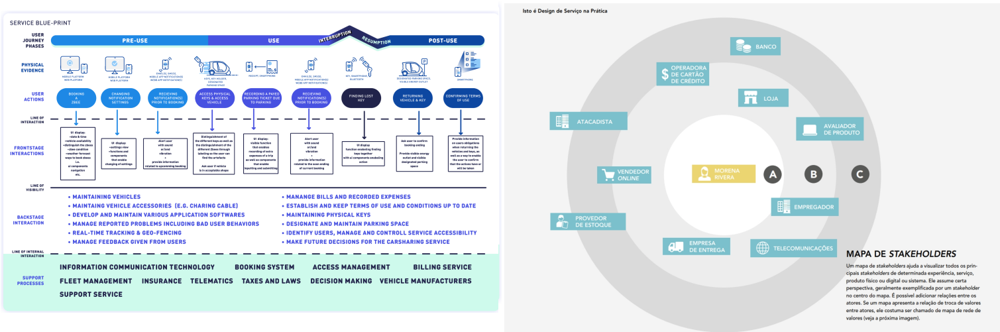

# Germinar (Necessidades)

Nesta fase, conforme a ideia do serviço começa a ganhar forma, é importante validar o problema e as necessidades com os cidadãos e as organizações, confirmando o escopo do serviço.

### Objetivo
Refinar e validar o problema e as necessidades dos cidadãos e das organizações, garantindo o alinhamento com o **ODS (Objetivos de Desenvolvimento Sustentável)**.

    
    
O objetivo nesta fase é refinar os conceitos e garantir que o serviço seja capaz de atender às necessidades identificadas e contribuir diretamente para os ODS.

- Alinhamento com os ODS
- Refinamento do escopo do serviço
- Validação com usuários por meio de protótipos e feedback

### Input

Durante a fase Germinar, é essencial trabalhar com uma série de inputs que ajudarão a moldar o serviço, permitindo o ajuste fino necessário para que ele atenda às necessidades dos usuários:

- **Estratégia Digital da organização**
- **Draft do projeto** (ACT...)
- **Canvas do escopo**

### Participantes

Nesta fase, diferentes grupos de interessados participam para garantir que o serviço está alinhado com as necessidades dos usuários e da organização.

- **Donos do serviço**
- **Time de TI**
- **Usuários finais do serviço**
- **Entre outros.**

---

### Técnicas e Ferramentas para Execução

| **Técnica**                   | **Descrição**                                                                                  |
|------------------------------|-----------------------------------------------------------------------------------------------|
| **Design baseado em cenários** | Auxilia na simulação de diferentes soluções para determinar o impacto e viabilidade do serviço. |
| **Blueprint do Serviço**      | Representa o fluxo de serviço, interações e pontos de contato entre stakeholders e usuários. |
| **Mapa de Stakeholders**      | Visualiza a relação e influência de todos os stakeholders envolvidos no serviço. |
| **Mapa de Ecossistema**       | Representa visualmente os atores e as trocas de valor no sistema onde o serviço está inserido. |
| **E, Não é, Faz, Não Faz**    | Técnica que ajuda a definir o que o serviço é e o que ele não é, o que faz e o que não faz. |
| **Enunciado do Problema**     | Define o problema principal que o serviço busca resolver. |
| **Colcha de Retalhos**        | Coleta de diferentes ideias ou insights fragmentados que juntos contribuem para a solução. |
| **Mapeamento de Necessidades**| Ferramenta para organizar e priorizar as necessidades dos usuários e da organização. |

---

### Output
- **Canvas de Necessidades** (Conceito do serviço refinado com mapeamento de lacunas e melhorias resultantes das interações com os usuários)

Como resultado, é gerado o **Canvas Germinar**, contendo o refinamento das informações preliminarmente definidas na fase Semear:

- O que é o serviço
- Para quem este serviço será criado.

---

## Considerações Gerais

Na fase denominada **Germinar**, o foco é confirmar as necessidades e refinar o conceito de serviço a partir da interação com os usuários. São realizadas oficinas de **Design Thinking**, nas quais se criam **personas** e **jornadas**, além de protótipos de baixa fidelidade para coleta de feedback.

