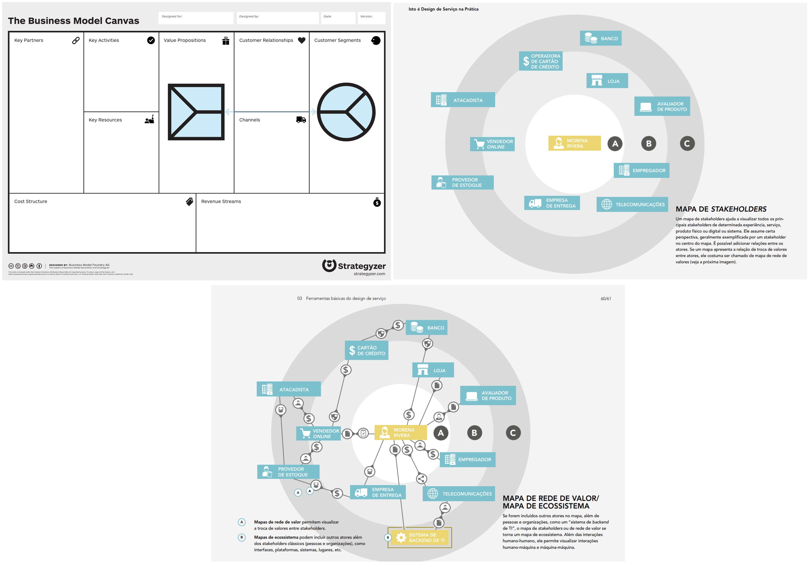

# Semear (Escopo)

Nesta fase, o processo de design do serviço começa com uma ideia ou conceito para um novo serviço que visa abordar um ODS (Objetivos de Desenvolvimento Sustentável) específico.

### Objetivo
Propor uma ideia ou conceito para um novo serviço ou evolução de um serviço existente, considerando os valores da organização pública **e da sociedade**.

    
    
O objetivo é semear a semente da inovação e nutrí-la com pesquisa e geração de ideias para ajudá-la a crescer e contribuir para alcançar os ODS. Aspectos importantes que denotam as condições da semeadura incluem:

- Análise de riscos,
- Valor gerado pelo serviço,
- Recursos humanos e tecnológicos disponíveis.

### Input

- **Análise de capacidade**
- **Políticas públicas**
- **Arcabouço legal** (Diretrizes que normatizam)
- **Escuta do cidadão**

### Participantes

- **Gestores e Donos do serviço**, 
- **Usuários finais do serviço**, 
- **Entre outros.**

---

### Técnicas e Ferramentas para Execução

| **Técnica**                   | **Descrição**                                                                                  |
|------------------------------|-----------------------------------------------------------------------------------------------|
| **Canvas Propostas de Valor** | Mapeia a proposta de valor e o perfil do consumidor, conectando o que é oferecido com as necessidades dos usuários. |
| **Canvas Modelo de Negócios** | Descreve como a organização gera valor, detalhando recursos, canais, custos e interações com o consumidor. |
| **Mapa de Rede de Valor**     | Visualiza as trocas de valor (informação, serviço ou dinheiro) entre stakeholders, destacando fluxos e relações. |
| **Mapa de Ecossistema**       | Representa visualmente atores, suas relações e as trocas de valor no sistema onde o serviço está inserido. |
| **Canvas de Codesign Empático**| Facilita a colaboração no desenvolvimento de soluções, destacando oportunidades a partir da perspectiva dos usuários. |
| **Pesquisa com Usuários**     | Coleta insights sobre as necessidades e experiências dos usuários, orientando o desenvolvimento centrado no cliente. |

---

### Output
- **Canvas do escopo** (Responde às perguntas: *O que é o serviço? Por que ele será criado? Para quem será criado?*)

Como resultado é produzido o **Canvas Semear**, contendo informações preliminares sobre:

- O que é o serviço
- Para quem este serviço será criado.

---

## Considerações Gerais

Na fase denominada **Semear** busca-se responder perguntas como:

- "O que é o serviço?"
- "Para quem este serviço será criado?"

Assim, inicia-se com uma ideia de inovação que é considerada a **semente**, e a pesquisa e geração de ideias a nutrem e a condicionam para a próxima fase, que é a **germinação**.

