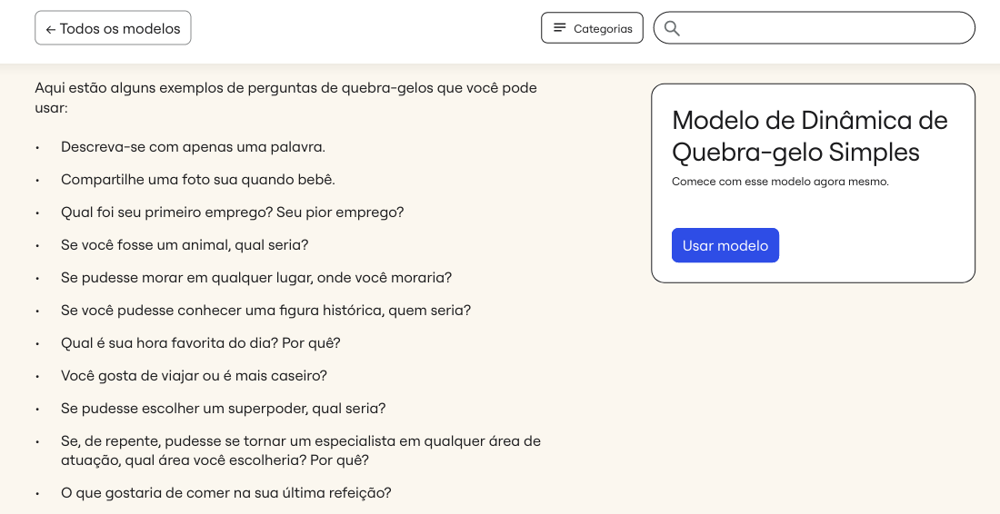
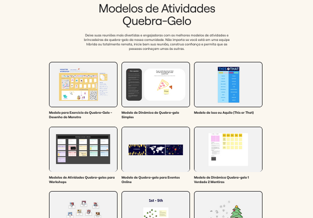

# Quebra-Gelo

O quebra-gelo é uma técnica usada para facilitar a interação e a comunicação entre os participantes de um grupo, especialmente em contextos de trabalho colaborativo ou eventos de grupo como oficinas. O objetivo é criar um ambiente mais descontraído e confortável, ajudando os participantes a se conhecerem melhor e a se sentirem mais à vontade para colaborar e compartilhar ideias.

## Como Funciona a Metodologia Quebra-Gelo?

Geralmente o quebra-gelo começa com atividades que incentivam os participantes a compartilhar algo pessoal ou interessante sobre si mesmos, como suas preferências ou experiências. São realizadas atividades simples e divertidas que ajudam a romper barreiras iniciais e a estimular a interação. 

Por exemplo: incluem jogos, discussões em grupo sobre tópicos leves como perguntas, ou atividades de colaboração. Essas atividades têm o propósito de criar uma conexão inicial entre os membros do grupo, facilitar a comunicação e reduzir tensões ou ansiedade que possam existir no início de um projeto ou reunião.

## Modelo de Quebra-Gelo

<h6 align="center">Imagem 1 - Exemplos de Perguntas para o quebra-gelo.</h6>

<h6 align="center">Fonte: Miro. 2024.</a>

  
<h6 align="center">Imagem 2 - modelos para o quebra-gelo.</h6>

<h6 align="center">Fonte: Miro. 2024.</a></h6>

No site do Miro, você pode encontrar uma variedade de ideias de perguntas e também de modelos interativos para aplicar a técnica do quebra-gelo, nas imagens 1 e 2 demonstra como é as páginas de modelos e perguntas. Para acessar esses materiais, clique nos links logo abaixo:

[Link_para_Perguntas](https://miro.com/pt/modelos/dinamica-quebra-gelo-simples/)

[Link_para_Modelos](https://miro.com/pt/modelos/brincadeiras-quebra-gelo/)
