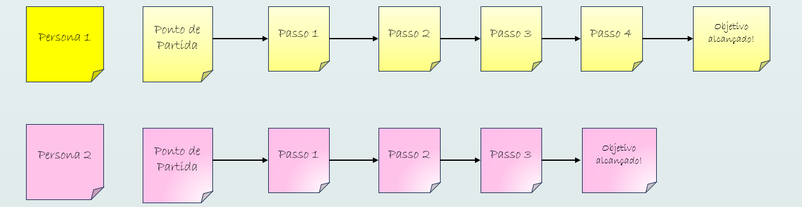

# Jornada do Usuário

A jornada do usuário é uma abordagem essencial para compreender a experiência do cliente ao interagir com um produto ou serviço. Essa técnica mapeia cada etapa que um usuário percorre, desde a descoberta até a utilização e a eventual fidelização. Compreender essa jornada é crucial para identificar pontos de dor e oportunidades de melhoria, assegurando que o produto atenda às expectativas dos usuários e melhore sua satisfação.

# Quando usá-la?

Utilize a jornada do usuário sempre que desejar entender como os usuários interagem com seu produto ao longo do tempo. Essa técnica é especialmente valiosa no início do desenvolvimento de um produto, ao coletar insights sobre as necessidades e expectativas dos usuários. Se você quer otimizar a experiência do cliente ou resolver problemas de usabilidade, é hora de mapear a jornada do usuário.

font size="3">
<b>Figura 1</b> exemplo de um fluxo de jornada de usuário

<b>Fonte: </b> Relatório - Oficinas de Lean Inception - ANAC - Safety Intelligence - Junho de 2024, página 35.

# A técnica na prática

A criação de uma jornada do usuário envolve algumas etapas essenciais. Primeiro, é importante reunir informações sobre os usuários, incluindo seus perfis, comportamentos e motivações. Isso pode ser feito através de entrevistas, pesquisas e análise de dados. Em seguida, você deve criar um mapa da jornada, que deve incluir as seguintes etapas:

- **Fases da jornada:** Identifique as principais fases que o usuário atravessa, como descoberta, consideração, compra, uso e lealdade. Cada fase deve refletir as interações que o usuário tem com o produto.

- **Canais de interação:** Mapeie os diferentes canais através dos quais os usuários interagem com o produto (site, redes sociais, atendimento ao cliente, etc.). Isso ajuda a entender onde ocorrem as interações mais significativas.

- **Pontos de dor e emoções:** Identifique os principais pontos de dor que os usuários enfrentam em cada fase, além das emoções que eles sentem ao longo da jornada. Isso pode ajudar a equipe a entender melhor as frustrações e alegrias do usuário.

- **Oportunidades de melhoria:** Com base na análise dos pontos de dor, é importante destacar as oportunidades para otimizar a experiência do usuário. Essas melhorias podem incluir ajustes no design, melhorias na funcionalidade ou mudanças na comunicação.

Ao mapear a jornada do usuário, a equipe pode visualizar a experiência do cliente e identificar áreas que precisam de atenção. Isso ajuda a criar um produto mais alinhado às expectativas do usuário.

<b>Figura 2</b> exemplo de uma jornada de usuário criada durante a oficina Safety Intelligence 

<b>Fonte: </b> Relatório - Oficinas de Lean Inception - ANAC - Safety Intelligence - Junho de 2024, página 36.

#O que a técnica agrega na oficina

A jornada do usuário agrega um valor significativo ao processo de design e desenvolvimento. Ao mapear a experiência do usuário, a equipe obtém uma visão holística de como os usuários interagem com o produto, permitindo a identificação de problemas de usabilidade e a otimização do design. O entendimento aprofundado das necessidades e expectativas dos usuários resulta em um produto mais intuitivo, eficiente e que proporciona uma experiência positiva. 

#Bibliografia

1.  MJV INNOVATION. Jornada do Usuário: o que é? Disponível em: [Jornada do Usuário](https://www.mjvinnovation.com/pt-br/blog/jornada-do-usuario-o-que-e/). Acesso em: 7 out. 2024.

2. Relatório - Oficinas de Lean Inception - ANAC - Safety Intelligence - Junho de 2024