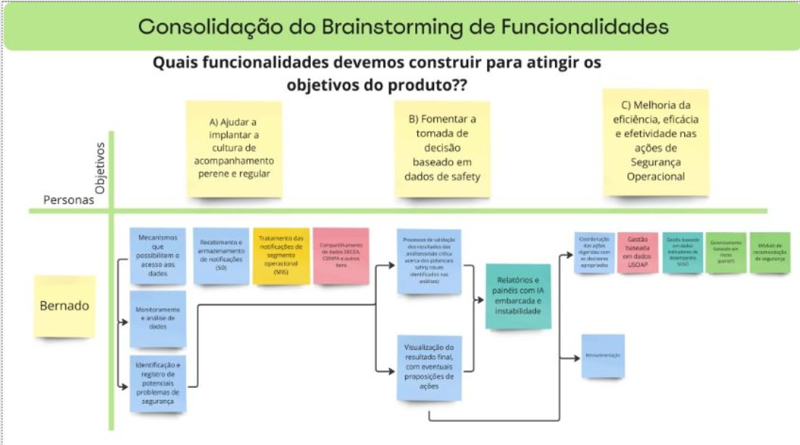

# Proposta do MVP

A proposta do MVP (Produto Mínimo Viável) foi uma atividade realizada no primeiro ciclo da oficina do "Report Safety". O objetivo dessa atividade foi definir as principais funcionalidades do produto com foco no que seria essencial. Antes de criar uma hipótese de negócio para o MVP, a equipe desenvolveu essa atividade para entender melhor o que era realmente importante. Essa atividade antecedeu a criação do canvas MVP, mas ambos foram usados de forma separada para desenvolver o produto.

---

# Quando usá-la?

Essa atividade deve ser utilizada quando o time está começando a desenvolver um produto novo e precisa de uma visão clara dos objetivos principais. A proposta do MVP foi feita antes da hipótese de negócio, permitindo que o time definisse os três principais objetivos do produto para o negócio.

---

# A atividade na prática

A atividade começou com uma pergunta simples para os participantes: 

<b>"Se você tivesse que resumir o produto em três objetivos para o negócio, quais seriam eles?".</b>

<h6 align="center">Imagem 1 - objetivos nos post-its e a votação.</h6>

<h6 align="center">Fonte: PAULA, et al. Relatório-ANAC-SAFETY INTELLIGENCE. 2024.</a></h6>

Cada um respondeu individualmente colocando em post-its. Em seguida, essas respostas foram consolidadas em uma votação, onde os três objetivos mais votados foram selecionados. Assim como demonstra na imagem 1, com os símbolos circulares, indicando a votação de cada.

Após essa votação, a equipe passou para um brainstorming de funcionalidades, com a seguinte pergunta: 

<b>"Quais funcionalidades devemos construir para atingir os objetivos do produto?".</b> 

<h6 align="center">Imagem 2 - brainstorming de funcionalidades.</h6>

<h6 align="center">Fonte: PAULA, et al. Relatório-ANAC-SAFETY INTELLIGENCE. 2024.</a></h6>

Com base nos objetivos votados, foram discutidas as funcionalidades necessárias para atingi-los, usando a persona "Bernardo" para ajudar a visualizar como o produto seria usado. Na imagem 2, o fluxo de "Bernardo" mostra várias funcionalidades que atendem aos objetivos escolhidos.

---

# O que a atividade agrega na oficina

A atividade ajuda a organizar as ideias da equipe de forma clara, permitindo que todos entendam o que é realmente necessário para o produto. Ao focar nos três objetivos principais, a equipe consegue evitar distrações e concentrar-se no que é essencial. A partir dessa proposta, foi possível consolidar as funcionalidades e entender como elas poderiam resolver os problemas.

---

# Bibliografia

1. PAULA, et al. Relatório-ANAC-SAFETY INTELLIGENCE. 2024.