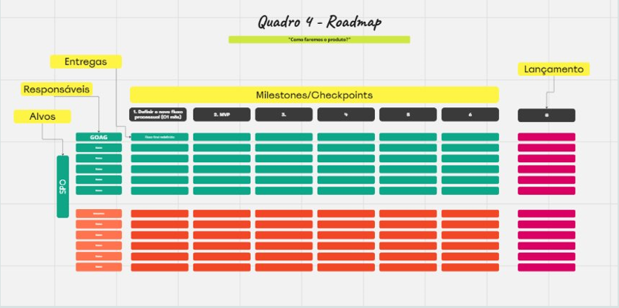

# Roadmap 

O roadmap de produto é uma ferramenta estratégica que comunica a visão, a direção e o progresso de um produto ao longo do tempo. Ele serve como um guia que alinha a equipe de desenvolvimento, stakeholders e clientes em torno das metas do produto, mostrando quais funcionalidades serão entregues e quando. Além disso, o roadmap permite priorizar tarefas e ajustar o planejamento conforme necessário.

## Quando usá-lo?

O roadmap de produto é essencial em várias etapas do ciclo de vida do produto. Use-o quando estiver planejando novas funcionalidades, definindo metas de longo prazo ou organizando entregas. Ele também é útil para comunicar o progresso do produto aos stakeholders e para garantir que a equipe esteja focada nas prioridades corretas.

## A técnica na prática

Criar um roadmap de produto eficiente envolve uma série de passos:

- **Definir a visão e os objetivos do produto:** O primeiro passo para criar um roadmap é estabelecer a visão do produto e seus objetivos. Eles devem ser claros e alinhados com a estratégia da empresa. A visão responde à pergunta "por que estamos construindo este produto?", enquanto os objetivos detalham "o que queremos alcançar?"

- **Identificar as funcionalidades e iniciativas principais:** Após definir os objetivos, identifique quais funcionalidades ou iniciativas são necessárias para alcançá-los. Liste as entregas principais que precisam ser desenvolvidas ao longo do tempo.

- **Priorizar e organizar:** Nem tudo pode ser feito ao mesmo tempo. Por isso, é importante priorizar as funcionalidades de acordo com o valor que elas agregam ao produto e ao negócio. As iniciativas mais críticas para alcançar os objetivos devem ser destacadas.

- **Definir prazos e recursos:** Cada entrega deve ter um prazo estimado, de acordo com os recursos disponíveis e a complexidade da tarefa. O roadmap geralmente é organizado em horizontes de tempo, como curto, médio e longo prazo, permitindo uma visão clara das prioridades imediatas e futuras.

- **Manter o roadmap atualizado:** O roadmap de produto não é estático; ele deve ser revisado regularmente para refletir mudanças no mercado, feedback dos usuários ou ajustes na estratégia da empresa. A flexibilidade é fundamental para garantir que o produto continue relevante e competitivo.

<b>Figura 1</b> exemplo de Roadmap 

<b>Fonte: </b> Relatório - Oficina de Design do Serviço - ANAC - Startuo CERTIFICA - maio de 2024, página 96.

## O que a técnica agrega na oficina

O roadmap de produto ajuda a equipe a se manter focada nas prioridades e a tomar decisões baseadas em dados e estratégias claras. Ele agrega valor ao oferecer uma visão de longo prazo, permitindo ajustes quando necessário e promovendo a transparência com stakeholders e clientes. Ao comunicar os planos e o progresso, o roadmap reduz incertezas e ajuda a gerenciar expectativas.

## Bibliografia

1. PM3. Roadmap de Produto: O que é, exemplo e como criar. Disponível em: [Roadmap de Produto](https://www.cursospm3.com.br/blog/roadmap-de-produto-o-que-e-exemplo-como-criar/?gad_source=1&gclid=Cj0KCQjwjY64BhCaARIsAIfc7YbTmoNooc0rYsR87_Kjvx-2dSevWvtoTH_t9JnD4CI7ce1v6TAOo7kaAqBXEALw_wcB). Acesso em: 7 out. 2024.

2. PRODUCTPLAN. Roadmap Basics. Disponível em: [Roadmap Basics](https://www.productplan.com/learn/roadmap-basics/). Acesso em: 7 out. 2024.

3. Relatório - Oficina de Design do Serviço - ANAC - Startuo CERTIFICA - maio de 2024.
