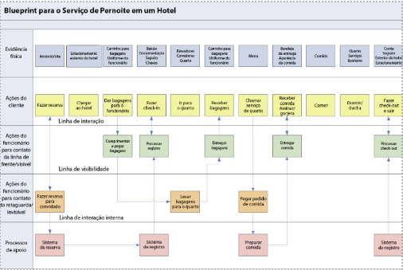

# Blueprint de Serviço

O **blueprint de serviço** é uma técnica visual usada para mapear de maneira detalhada todos os processos envolvidos na entrega de um serviço. Criada por Shostack em 1984, a ferramenta permite que organizações identifiquem gargalos, falhas e oportunidades de melhoria tanto nas interações com o cliente quanto nos processos internos e de suporte. Com isso, o blueprint é uma importante técnica para otimizar a experiência do cliente e aumentar a eficiência operacional.

<b>Figura 1</b> - Estrutura básica de um blueprint de serviço

<b>Fonte: </b> COSTA, J. E. et al. Mapeamento de Experiências: Um guia para criar valor por meio de jornadas, blueprints e diagramas (2016).​

---

## Quando usá-la?

O blueprint de serviço deve ser utilizado quando a equipe precisa mapear e compreender todos os processos envolvidos na prestação de um serviço, desde a interação do cliente até os processos internos. Ele é ideal para empresas que querem:

- Revisar e otimizar processos de serviço existentes.
- Desenvolver novos serviços.
- Identificar gargalos e pontos de falha nas operações.
- Alinhar a visão de todos os envolvidos na entrega do serviço.

A técnica é especialmente útil em contextos onde se busca melhorar a eficiência interna, a coesão da equipe e a experiência do cliente de forma proativa.

---

## A técnica na prática

Para aplicar o blueprint de serviço de forma eficaz, é necessário seguir algumas etapas:

Mapeie os elementos do serviço: Identifique as principais camadas do serviço, que incluem as interações com o cliente e os processos internos. Abaixo está uma tabela com os componentes que devem ser mapeados no blueprint:

| **Elementos do Blueprint de Serviço** | **Descrição**                                                                                     |
|--------------------------------------|---------------------------------------------------------------------------------------------------|
| **Evidência física**                 | Pontos de contato físicos ou digitais que o cliente interage, como sites, aplicativos ou dispositivos. |
| **Ações do cliente**                 | As etapas que o cliente percorre ao utilizar o serviço.                                             |
| **Ações da linha de frente**         | Atividades que os funcionários realizam na presença do cliente, visíveis ao cliente.                |
| **Ações da retaguarda**              | Processos invisíveis ao cliente, mas essenciais para o funcionamento do serviço.                    |
| **Processos de suporte**             | Operações internas que garantem o funcionamento contínuo do serviço, como sistemas de TI.            |

Organize as interações por linhas de visibilidade: Use as **linhas de visibilidade** para separar as diferentes camadas do serviço:

- **Linha de interação**: Separa as ações do cliente das ações visíveis da equipe de linha de frente.
- **Linha de visibilidade**: Separa o que é visível ao cliente dos processos de bastidores.
- **Linha de interação interna**: Separa as atividades de suporte e retaguarda das atividades da linha de frente.

Identifique gargalos e pontos de falha: Ao mapear o blueprint, identifique onde podem ocorrer problemas ou ineficiências. Esses pontos devem ser priorizados para otimização.

Implemente e revise: Após a criação do blueprint, ele deve ser constantemente revisitado e atualizado à medida que o serviço ou os processos internos mudam.

<b>Figura 2</b>- Exemplo de blueprint na prática

<b>Fonte: </b>Kalbach, J. (2016). Mapping experiences: A complete guide to creating value through journeys, blueprints, and diagrams. O'Reilly Media. Página 105.​

---

## O que a técnica agrega na oficina

O blueprint de serviço oferece uma série de benefícios para oficinas e projetos de melhoria de processos:

- **Visão ampla e detalhada do serviço**: Permite que a equipe veja tanto as interações do cliente quanto os processos internos, criando um entendimento claro de toda a cadeia de prestação do serviço.
- **Identificação antecipada de problemas**: Ao mapear todas as etapas, a equipe consegue identificar gargalos e falhas antes que afetem a experiência do cliente, permitindo a resolução antecipada desses problemas.
- **Alinhamento e eficiência**: Garante que todos os membros da equipe estejam alinhados em relação aos processos e funções de cada um, promovendo uma visão compartilhada e mais eficiência nas operações.
- **Facilita a inovação**: Ao visualizar o fluxo de trabalho, o blueprint permite que a equipe pense em novas formas de otimizar e inovar no serviço, criando oportunidades de melhoria contínua.

## Bibliografia

1.Kalbach, J. (2016). Mapping experiences: A complete guide to creating value through journeys, blueprints, and diagrams. O'Reilly Media.

2.COSTA, J. E. et al. Mapeamento de Experiências: Um guia para criar valor por meio de jornadas blueprints e diagramas. 2016.

3.Nielsen Norman Group. Service Blueprinting in Practice. Disponível em: https://www.nngroup.com/articles/service-blueprinting-practice/. 

4.GIBBONS, S. Service blueprints: Definition. Disponível em: <https://www.nngroup.com/articles/service-blueprints-definition/>. 
