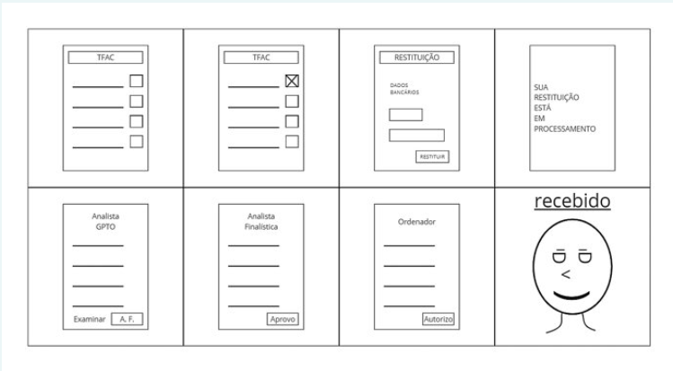

# Brainstorming

O **brainstorming** é uma técnica de geração de ideias que estimula a liberdade de pensamento e a colaboração. Ele é amplamente utilizado em situações em que uma equipe precisa encontrar soluções criativas para problemas complexos ou explorar novas oportunidades. O princípio fundamental do brainstorming é suspender o julgamento das ideias durante o processo inicial, permitindo que as sugestões mais inusitadas e criativas floresçam antes de serem avaliadas.

---

## Quando usá-la?

O brainstorming deve ser utilizado quando:

- Há necessidade de encontrar múltiplas soluções para um problema complexo.
- O time está bloqueado criativamente e precisa destravar novas ideias.
- É necessário explorar novas perspectivas ou desafiar as abordagens tradicionais para um projeto.
- A equipe precisa de uma colaboração que permita diversas vozes e ideias serem ouvidas, sem julgamentos iniciais.

---

## A técnica na prática

O processo de brainstorming envolve várias etapas fundamentais:

1.Preparação para o Brainstorming:

   - **Definir o Problema ou Tópico Central**: Certifique-se de que todos os participantes entendam claramente qual é o problema ou objetivo a ser abordado.
   - **Formar a Equipe**: Reúna participantes de diversas áreas para ampliar a diversidade de perspectivas.
   - **Escolher o Ambiente**: Crie um espaço colaborativo, que pode ser tanto físico quanto virtual, onde ferramentas como post-its ou aplicativos como Miro ou Jamboard possam ser usados.

2.Fase de Exploração (Geração de Ideias):

   - **Liberdade Criativa**: Permita que todas as ideias sejam expressas, por mais improváveis que pareçam.
   - **Sem Críticas**: Durante essa fase, evite julgamentos para garantir que os participantes se sintam à vontade para sugerir qualquer ideia.
   - **Volume de Ideias**: Foque em gerar a maior quantidade possível de sugestões.

3.Fase de Convergência (Organização das Ideias):

   - Agrupe as ideias em categorias ou temas semelhantes, ajudando a identificar padrões ou oportunidades recorrentes.

4.Fase de Avaliação e Refinamento:

   - Após organizar as ideias, comece a aplicar critérios de avaliação, como viabilidade e impacto, para priorizar as mais promissoras.

5.Ação: Implementação das Ideias:

   - Defina um plano de ação para transformar as melhores ideias em projetos concretos, delegando responsabilidades e prazos claros.

Técnicas como o **Brainstorming Reverso**, o **Gap Filling**, e o **Role Play Brainstorming**  e  **crazy 8's** podem ser usadas para enriquecer esse processo, adaptando-se ao tipo de problema e ao grupo envolvido.

<b>Figura 1</b> Exemplo de aplicação de brainstorm utilizando a técnica crazy 8's

<b>Fonte: </b> Relatório Ciclo 2 - Oficinas e prototipação - ANAC - HUB FINANCEIRO - agosto de 2024, página 73.

---

## O que a técnica agrega na oficina

O brainstorming é uma técnica poderosa que agrega os seguintes benefícios às oficinas:

- **Estimula a Criatividade Coletiva**: A colaboração entre os participantes ajuda a expandir ideias iniciais e a criar soluções mais inovadoras.
- **Rapidez na Geração de Ideias**: A dinâmica rápida do brainstorming permite que uma vasta quantidade de soluções seja explorada em um curto espaço de tempo.
- **Quebra de Barreiras Mentais**: A técnica incentiva os participantes a irem além das soluções óbvias, resultando em ideias mais inovadoras e diversificadas.

---

## Bibliografia

1. *Brainstorming: Técnicas Para Destravar Suas Ideias*. Aela. Disponível em: [Aela.io](https://www.aela.io/pt-br/blog/conteudos/brainstorming-tecnicas-para-destravar-suas-ideias).
2. *Brainstorming Techniques for Idea Generation*. Interaction Design Foundation. Disponível em: [Interaction Design](https://www.interaction-design.org/literature/topics/brainstorming?srsltid=AfmBOoqlnACQpBhd-Qn0x2vsY5Gl1IjjtzPTqCwbA1Spe01ooJnVVf7I).
3. *Brainstorming para SEO: O que é e como aplicá-lo?* Ebac. Disponível em: [Ebac Online](https://ebaconline.com.br/blog/brainstorming-seo).
4. Relatório Ciclo 2 - Oficinas e prototipação - ANAC - HUB FINANCEIRO - agosto de 2024.