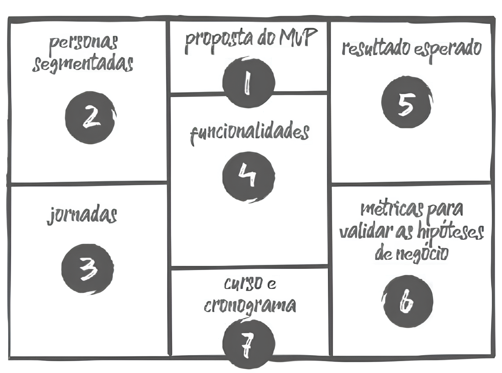

# Canvas MVP

O Canvas MVP é uma ferramenta essencial para validar ideias de produtos. Ele fornece uma visão clara e objetiva de como o MVP (Produto Mínimo Viável) será definido e desenvolvido. Com isso, a equipe pode alinhar suas expectativas e hipóteses de negócio de forma rápida e eficaz, garantindo que o produto seja construído com foco nas funcionalidades mais essenciais e com baixo custo de experimentação.

## Quando usá-la?

O Canvas MVP deve ser utilizado quando uma equipe ou empresa deseja testar um produto novo ou uma nova funcionalidade sem investir em um desenvolvimento completo. A ideia é criar uma versão simplificada, mas funcional, do produto, que possa ser entregue ao mercado para validar as hipóteses iniciais.

## A técnica na prática

O Canvas MVP é composto por sete blocos que guiam o planejamento e a execução do MVP:

| Bloco                | Descrição                                                                                                                                                  |
|----------------------|------------------------------------------------------------------------------------------------------------------------------------------------------------|
| **Proposta do MVP**   | Define a proposta central do MVP. O que ele visa resolver?                                                                                                 |
| **Personas**          | Identifica para quem o MVP está sendo desenvolvido. Quais grupos de usuários serão testados primeiro?                                                      |
| **Jornadas**          | Mapeia as jornadas dos usuários que o MVP irá atender ou melhorar.                                                                                         |
| **Funcionalidades**   | Lista as funcionalidades que serão construídas no MVP, descrevendo quais ações serão simplificadas ou aprimoradas.                                         |
| **Resultado esperado**| Define o aprendizado ou resultado que se espera obter com o MVP.                                                                                           |
| **Métricas**          | Especifica como o sucesso do MVP será medido. Quais métricas indicarão que as hipóteses de negócios estão corretas?                                        |
| **Custo e Cronograma**| Detalha o custo estimado e o cronograma para o desenvolvimento e a coleta de dados do MVP.                                                                 |

<h6 align="center">Imagem 1 - Estrutura de um Canvas MVP.</h6>

<h6 align="center">Fonte: CAROLI, Paulo. 2024 </a></h6>

## O que a técnica agrega na oficina

O Canvas MVP proporciona um alinhamento claro entre os membros da equipe e stakeholders, garantindo que todos compartilhem a mesma visão do produto. Além disso, permite definir um escopo mínimo e funcional, ajudando a evitar a criação de funcionalidades desnecessárias e garantindo que o produto evolua de forma eficiente e com base em dados reais coletados dos usuários.

## Bibliografia

1. PROVINCIATTO, Mary; CAROLI, Paulo. Sprint a sprint: erros e acertos na transformação cultural de um time ágil. 2020.
2. CAROLI, Paulo. O Canvas MVP. Disponível em: https://caroli.org/o-canvas-mvp/. Acesso em: 9 out. 2024.
