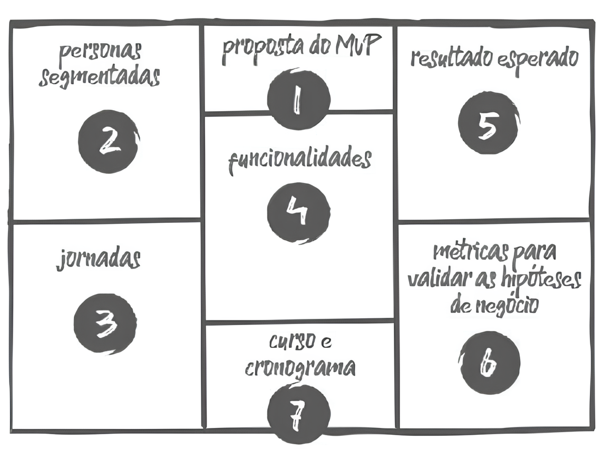

# Metodologia Disney 

A Metodologia Disney é uma abordagem estruturada para promover criatividade e inovação, dividida em três perspectivas que visam explorar diferentes formas de pensamento para a resolução de problemas e criação de soluções. Adaptada para oficinas específicas, a metodologia mantém o foco na exploração criativa, no planejamento realista e na crítica construtiva, garantindo que ideias inovadoras sejam transformadas em planos viáveis e sustentáveis.

## Quando usá-la?

A metodologia deve ser aplicada em oficinas ou sessões de desenvolvimento de ideias que exijam criatividade, planejamento prático e análise crítica. É especialmente eficaz para equipes que buscam inovação, mas precisam estruturar suas ideias em etapas viáveis de implementação.

## O método na prática

A Metodologia Disney é dividida em três fases, cada uma com um foco específico, permitindo que as ideias sejam geradas, desenvolvidas e criticadas de forma estruturada:

| Sessão          | Descrição                                                                                                                                                    |
|-----------------|--------------------------------------------------------------------------------------------------------------------------------------------------------------|
| **O Sonhador**  | Geração de ideias sem limitações ou críticas. A equipe realiza um brainstorming livre e imaginativo, permitindo que todas as ideias sejam exploradas.           |
| **O Realista**  | Transformação das ideias geradas em planos práticos e detalhados. Aqui, o foco é desenvolver ações viáveis que possam ser implementadas de forma eficaz.        |
| **O Crítico**   | Identificação de problemas e desafios potenciais. Nesta fase, a equipe avalia as ideias e planos para detectar riscos, falhas e possíveis obstáculos.           |

<h6 align="center">Imagem 1 - Estrutura de um método Disney.</h6>

<h6 align="center">Fonte: Miro. 2024. </a></h6>

## O que o método agrega na oficina

Este método proporciona um equilíbrio entre criatividade, viabilidade e análise crítica. Ao separar o processo em três fases, a técnica permite que ideias inovadoras sejam geradas de forma livre, sem restrições, e posteriormente refinadas em planos concretos, com uma avaliação cuidadosa dos riscos. Isso resulta em um processo de inovação mais robusto e eficaz.

## Bibliografia

1. MIRO. Modelo de Estratégia de Marketing da Disney. Disponível em: https://miro.com/pt/modelos/estrategia-marketing-disney/. Acesso em: 7 out. 2024.
