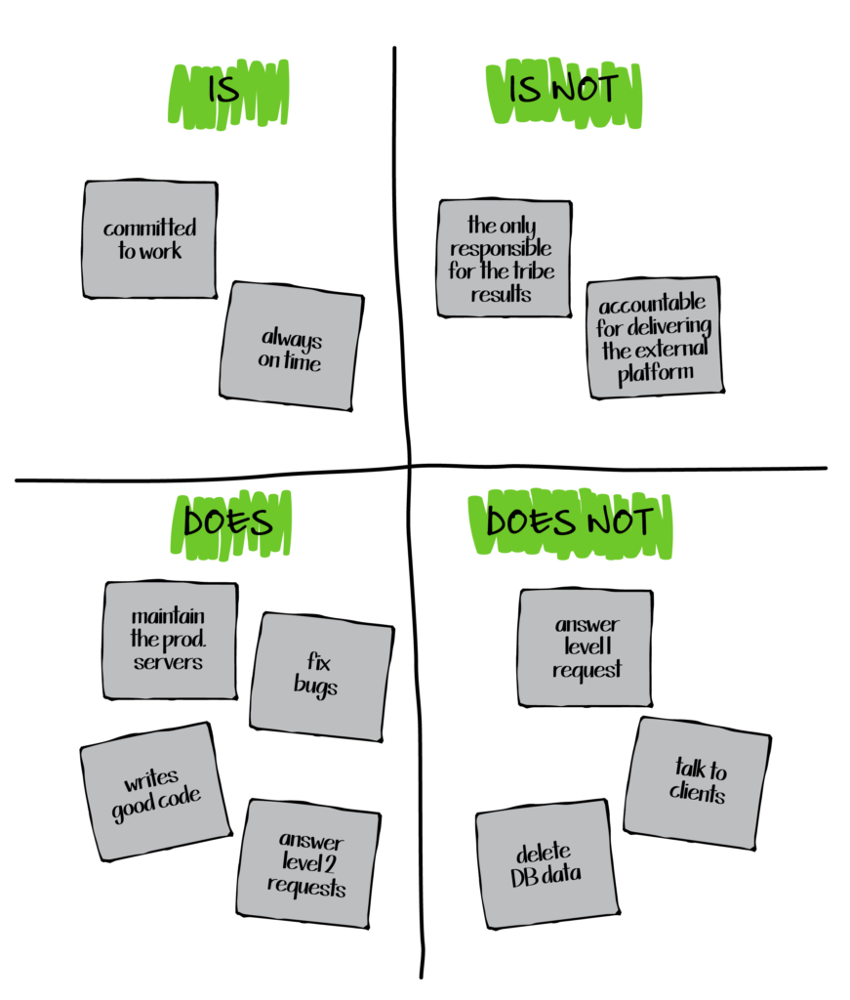

# É, Não é, Faz, Não faz

A técnica *É, Não é, Faz, Não faz* é uma ferramenta estratégica de definição de escopo que auxilia equipes a esclarecer e alinhar uma visão compartilhada sobre um produto, projeto ou ideia. Ela é estruturada em quatro quadrantes que ajudam a distinguir claramente as características essenciais, os limites, as funcionalidades e as não-funcionalidades de uma solução. Sua simplicidade e eficácia tornam essa técnica amplamente utilizada, especialmente em sessões de brainstorming, planejamento de produto e design de soluções.

## Quando usá-la?

Esta técnica é ideal para ser aplicada nas fases iniciais de desenvolvimento de projetos ou produtos, quando há a necessidade de definir e esclarecer o escopo da solução. Também pode ser usada em revisões posteriores, para ajustar o escopo em função de mudanças no mercado ou nas necessidades do projeto.

## A técnica na prática

A técnica é dividida em quatro quadrantes que organizam as informações-chave sobre a ideia ou projeto:

| Quadrante | Descrição |
|-----------|-----------|
| **É**     | Define o que a ideia, produto ou projeto **é**. Descreve características essenciais, a natureza do projeto e o valor principal que a solução entrega. |
| **Não é** | Define o que a ideia, produto ou projeto **não é**. Estabelece limites e fronteiras, evitando confusões ou expansões indevidas de escopo. |
| **Faz**   | Descreve o que o produto ou projeto **faz** em termos de funcionalidades e ações que geram valor para os usuários. |
| **Não faz**| Especifica o que a solução **não faz**, ajudando a gerenciar expectativas e evitando o "escopo inchado". |

### Passo a Passo

1. **Preparação**: Divida um quadro em quatro quadrantes: **É**, **Não é**, **Faz**, **Não faz**.
2. **Definição do Produto**: Insira o nome do produto ou serviço no topo do quadro.
3. **Participação**: Os participantes preenchem os quadrantes com post-its ou notas digitais, destacando os atributos, funcionalidades e limitações do produto.
4. **Discussão e Agrupamento**: Análises em grupo das ideias e agrupamento de conceitos semelhantes.
5. **Refinamento**: Ajuste das descrições para garantir um entendimento claro e comum.

<h6 align="center">Imagem 1 - Estrutura de um É, Não é, Faz, Não faz.</h6>

<h6 align="center">Fonte: OPEN PRACTICE LIBRARY. Is – Is not – Does – Does not. 2024. </a></h6>

## O que a técnica agrega na oficina

A técnica **É, Não é, Faz, Não faz** agrega valor ao trazer clareza e foco ao escopo do projeto, prevenindo a expansão descontrolada do escopo e promovendo o alinhamento entre diferentes stakeholders. Ela também facilita o gerenciamento de expectativas, garantindo que todos compreendam o que será e o que não será entregue, evitando mal-entendidos durante o desenvolvimento do projeto.

## Bibliografia

1. CAROLI, Paulo. E não é, faz, não faz. Disponível em: https://caroli.org/e-nao-e-faz-nao-faz. Acesso em: 1 out. 2024.
2. FOWLER, Martin. The product Is – Is not – Does – Does not. Disponível em: https://martinfowler.com/articles/lean-inception/product-is-isnot.html. Acesso em: 1 out. 2024.
3. OPEN PRACTICE LIBRARY. Is – Is not – Does – Does not. Disponível em: https://openpracticelibrary.com/practice/is-is-not-does-does-not/. Acesso em: 1 out. 2024.

