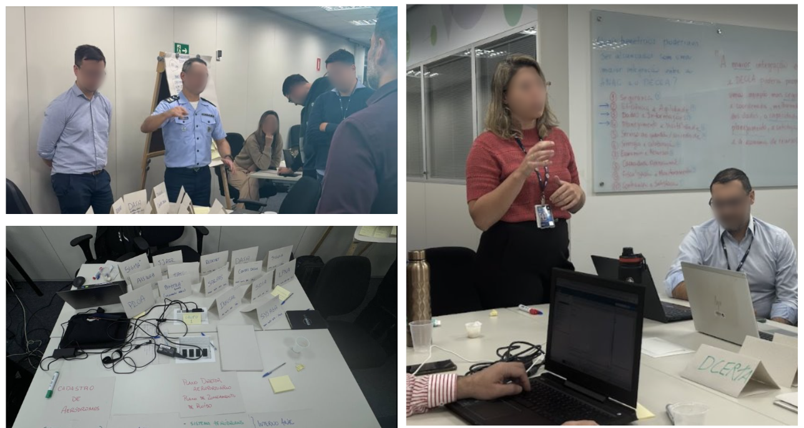

# Feira e Caldeirão de Serviços

A **Feira e Caldeirão de Serviços** são dinâmicas colaborativas utilizadas em oficinas de inovação e design, principalmente para explorar e priorizar diferentes serviços ou sistemas que possam ser de interesse para as equipes participantes. Essas atividades permitem que os participantes visualizem, discutam e selecionem os serviços mais relevantes de forma prática e interativa.

---

## Quando usá-las?

Essas técnicas são ideais quando há uma necessidade de exposição rápida a várias áreas de serviço, com o objetivo de identificar as mais relevantes para cada participante. Utilizam-se em contextos onde é necessário visualizar de forma clara os serviços disponíveis, como por exemplo:

- **Oficinas de priorização de serviços** entre diferentes áreas ou departamentos.
- **Workshops de integração de sistemas** para explorar e visualizar diferentes serviços e tecnologias disponíveis.

<b>Figura 1</b> - Dinâmica da Feira de Serviços

<b>Fonte: </b>ITRAC, Oficinas de UX.

---

## A técnica na prática

### Feira de Serviços:
1. **Objetivo**: Expor os serviços/sistemas de diferentes áreas e departamentos para os participantes.
2. **Dinâmica**: Cada participante visita os stands das áreas (ou estações de serviço), onde recebem informações sobre os serviços oferecidos. Cada sessão dura cerca de 10 a 15 minutos.
3. **Resultado esperado**: Ao final, os participantes terão uma visão clara dos serviços/sistemas mais relevantes para suas necessidades e poderão decidir quais explorar ou integrar.

### Caldeirão de Serviços:
1. **Objetivo**: Coletar feedback e listar os serviços/sistemas que foram de maior interesse durante a Feira de Serviços.
2. **Dinâmica**: Após visitar as estações, os participantes escrevem em post-its os serviços que consideraram mais interessantes ou úteis para suas áreas e os colocam em um "caldeirão" colaborativo.
3. **Resultado esperado**: O caldeirão serve como um repositório de ideias e serviços, permitindo que cada equipe discuta e priorize o que é mais relevante para o seu trabalho.

---

## O que essas técnicas agregam na oficina

Essas dinâmicas colaborativas trazem vários benefícios à estrutura de uma oficina, tais como:

- **Exploração eficiente de serviços**: Os participantes podem explorar várias opções de serviços em um curto espaço de tempo, garantindo uma melhor visão geral.
- **Priorização colaborativa**: O uso de post-its no Caldeirão de Serviços permite que a equipe colabore ativamente na priorização dos serviços que realmente farão diferença.
- **Engajamento entre áreas**: Facilita o diálogo entre departamentos, promovendo uma troca de informações que pode não acontecer em situações normais de trabalho.
- **Economia de tempo**: As sessões de 10 a 15 minutos e a discussão colaborativa agilizam o processo de tomada de decisões, algo fundamental em oficinas com tempo limitado.

---

## Bibliografia

1. Relatório Integração DECEA - ANAC - jul. 2024.