# Técnicas e ferramentas para oficinas 

As técnicas e ferramentas são fundamentais para cultivar um ambiente de aprendizado dinâmico e colaborativo. Elas não apenas facilitam a interação entre os participantes, mas também potencializam a criatividade, geração de ideias e soluções. Desde exercícios de quebra-gelo que ajudam a deixar o ambiente mais leve até métodos como brainstorming e prototipagem, cada técnica desempenha um papel importante em guiar o grupo. 

## <a style="color: #1a73e8; font-weight: 500;" href="../tecnicas-e-ferramentas/5w2h">5W2H</a>

    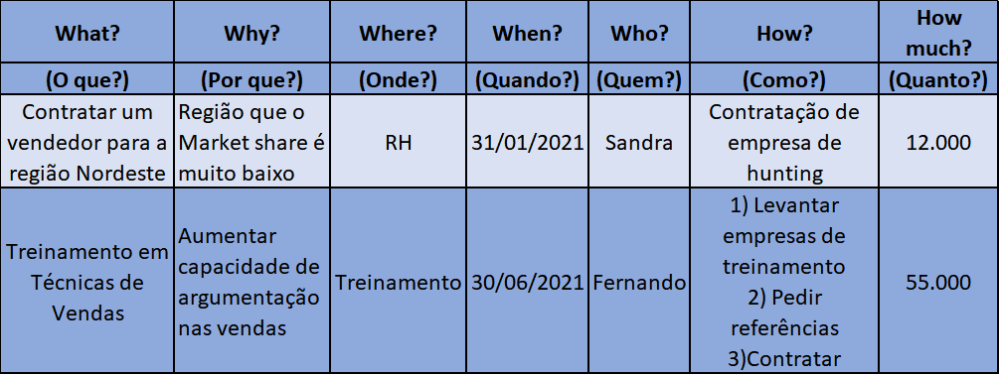
    

        <h4 style="margin: 0; color: #5f6368; font-weight: 400;">FERRAMENTA</h4>
        
O método 5W2H é uma ferramenta de planejamento que organiza ações e projetos, baseado em sete perguntas essenciais: What, Why, Who, Where, When, How e How Much, ajudando as equipes a planejar de forma clara e eficaz.

         
        
Pertence a seguinte fase do Calliandra:

        Brotar
         
         
        <a style="margin: 0; color: #1a73e8; font-weight: 500;" href="../tecnicas-e-ferramentas/5w2h">Veja mais</a>
    

 

--------------------------------------------------------
## <a style="color: #1a73e8; font-weight: 500;" href="../tecnicas-e-ferramentas/benchmarking">Benchmarking</a>

    
    

        <h4 style="margin: 0; color: #5f6368; font-weight: 400;">TÉCNICA</h4>
        
O Benchmarking é uma técnica que compara práticas e produtos de uma empresa com os de líderes de mercado, visando identificar melhorias e aumentar a competitividade.

         
        
Pertence a seguinte fase do Calliandra:

        Florescer
        Amadurecer
         
         
        <a style="margin: 0; color: #1a73e8; font-weight: 500;" href="../tecnicas-e-ferramentas/benchmarking">Veja mais</a>
    

 

--------------------------------------------------------
## <a style="color: #1a73e8; font-weight: 500;" href="../tecnicas-e-ferramentas/blueprint">Blueprint</a>

    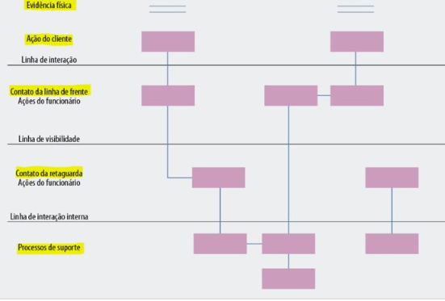
    

        <h4 style="margin: 0; color: #5f6368; font-weight: 400;">TÉCNICA</h4>
        
O blueprint de serviço é uma ferramenta que mapeia todas as etapas de um serviço, desde a interação com o cliente até os processos internos. Ele ajuda a identificar pontos críticos, melhorar a eficiência e garantir uma entrega consistente. Além disso, facilita a adaptação de novas tecnologias, ao oferecer uma visão clara de como os diferentes elementos do serviço estão interligados.

         
        
Pertence a seguinte fase do Calliandra:

        Geminar
        Brotar
         
         
        <a style="margin: 0; color: #1a73e8; font-weight: 500;" href="../tecnicas-e-ferramentas/blueprint.md">Veja mais</a>
    

--------------------------------------------------------
## <a style="color: #1a73e8; font-weight: 500;" href="../tecnicas-e-ferramentas/brainstorm.md">Brainstorm</a>

    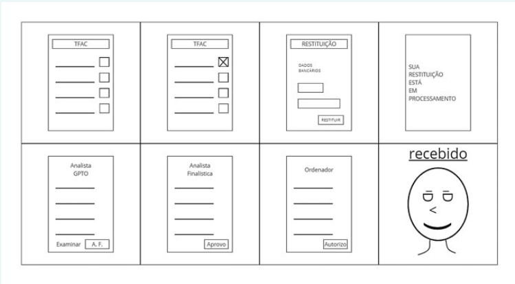
    

        <h4 style="margin: 0; color: #5f6368; font-weight: 400;">TÉCNICA</h4>
        
O brainstorm é uma técnica de geração de ideias que incentiva a criatividade em grupo, permitindo a criação de soluções inovadoras. Ele não é um processo estruturado ou limitado a ideias filtradas, mas sim um ambiente livre de críticas. O brainstorm faz com que participantes contribuam com ideias espontâneas e diversas. No entanto, não faz a análise ou avaliação dessas ideias, que ocorre posteriormente.

         
        
Pertence a seguinte fase do Calliandra:

      Brotar
         
         
        <a style="margin: 0; color: #1a73e8; font-weight: 500;" href="../tecnicas-e-ferramentas/brainstorm.md">Veja mais</a>
    

--------------------------------------------------------
## <a style="color: #1a73e8; font-weight: 500;" href="../tecnicas-e-ferramentas/canvasMVP.md">Canvas MVP</a>

    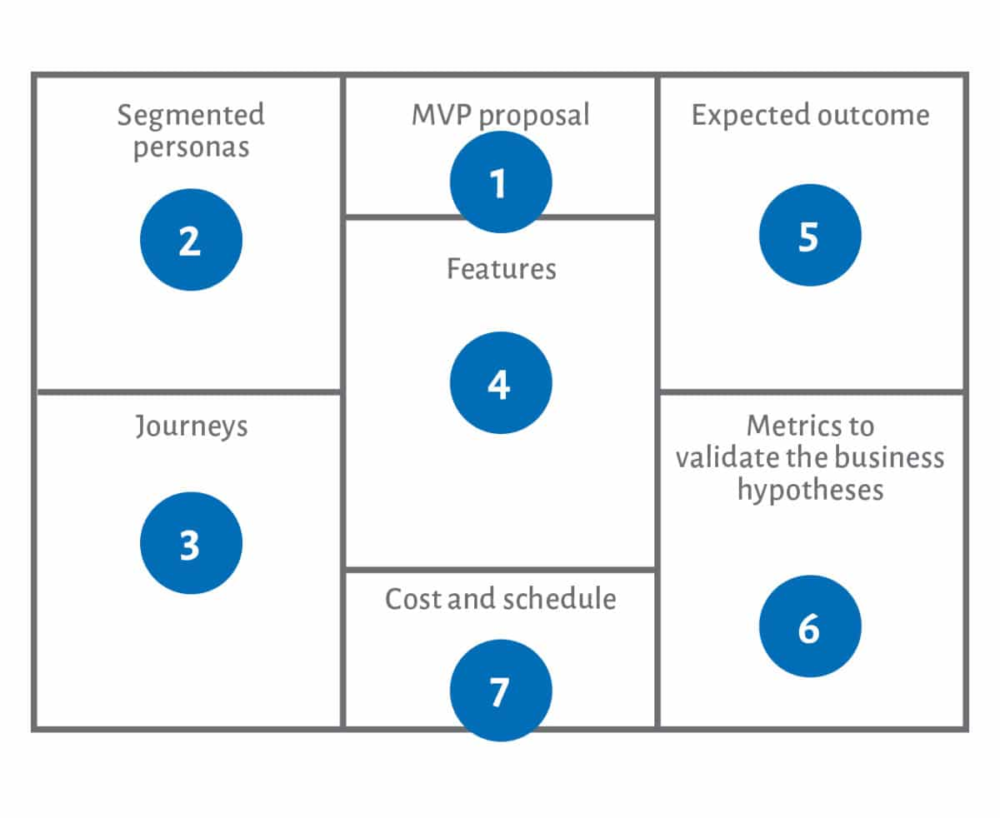
    

        <h4 style="margin: 0; color: #5f6368; font-weight: 400;">TÉCNICA</h4>
        
A técnica Canvas MVP é uma ferramenta visual que ajuda a definir e planejar o mínimo produto viável (MVP). Ela **não é** uma metodologia complexa ou detalhada, mas sim um modelo simples para estruturar ideias rapidamente. O Canvas MVP **faz** com que equipes identifiquem as características essenciais do produto e testem hipóteses de valor com o mínimo esforço. No entanto, **não faz** uma análise completa do produto final, focando apenas nas funcionalidades mínimas necessárias para validar a ideia.

         
        
Pertence a seguinte fase do Calliandra:

        Semear
         
         
        <a style="margin: 0; color: #1a73e8; font-weight: 500;" href="../tecnicas-e-ferramentas/canvasMVP.md">Veja mais</a>
    

--------------------------------------------------------
## <a style="color: #1a73e8; font-weight: 500;" href="../tecnicas-e-ferramentas/colchaDeRetalhos">Colcha de Retalhos</a>

    
    

        <h4 style="margin: 0; color: #5f6368; font-weight: 400;">TÉCNICA</h4>
        
A técnica da "Colcha de Retalhos" usa a ideia de costurar pedaços de tecido para promover a troca de conhecimentos em oficinas. A colcha representa o aprendizado colaborativo entre os participantes.

         
        
Pertence a seguinte fase do Calliandra:

        Não possui
         
         
        <a style="margin: 0; color: #1a73e8; font-weight: 500;" href="../tecnicas-e-ferramentas/colchaDeRetalhos">Veja mais</a>
    

 

--------------------------------------------------------
## <a style="color: #1a73e8; font-weight: 500;" href="../tecnicas-e-ferramentas/comoNosPodemos">Como Nós Podemos (CNP)</a>

    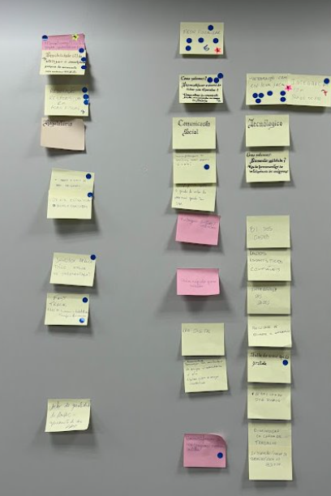
    

        <h4 style="margin: 0; color: #5f6368; font-weight: 400;">TÉCNICA</h4>
        
A técnica "Como Nós Podemos" transforma problemas em oportunidades criativas, incentivando a geração de novas ideias em atividades de Design Thinking e inovação.

         
        
Pertence a seguinte fase do Calliandra:

        Semear
        Amadurecer
         
         
        <a style="margin: 0; color: #1a73e8; font-weight: 500;" href="../tecnicas-e-ferramentas/comoNosPodemos">Veja mais</a>
    

 

--------------------------------------------------------
## <a style="color: #1a73e8; font-weight: 500;" href="../tecnicas-e-ferramentas/eNaoFazNaoFaz.md">É - Não é - Faz - Não faz</a>

    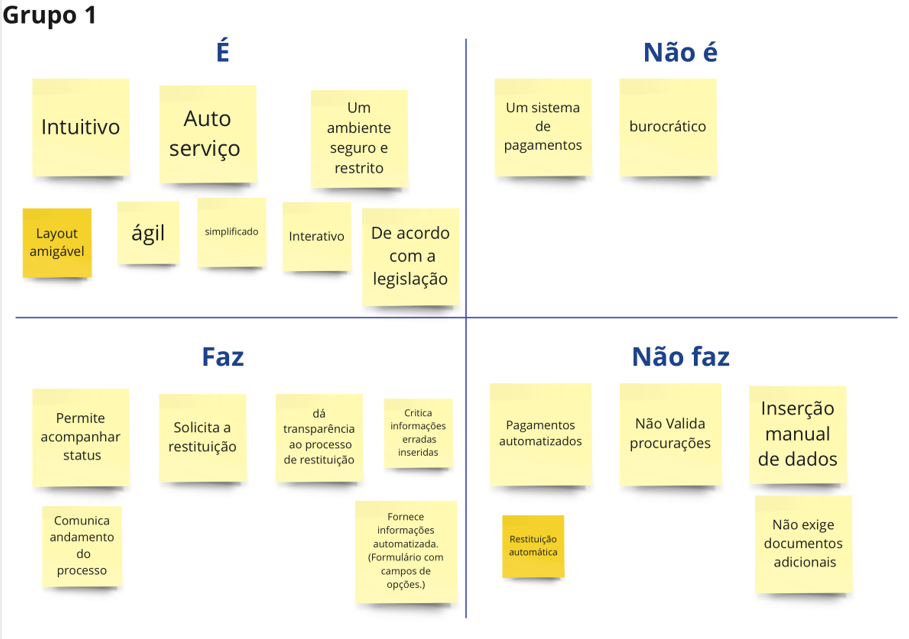
    

        <h4 style="margin: 0; color: #5f6368; font-weight: 400;">TÉCNICA</h4>
        
A técnica É, Não é, Faz, Não faz é uma ferramenta estratégica que ajuda a definir o escopo de um projeto ou produto. Ela não é um modelo complexo ou técnico, sendo simples e visual. A técnica faz com que equipes alinhem expectativas e esclareçam características essenciais. No entanto, não faz uma análise detalhada de funcionalidades ou soluções, servindo apenas para delimitar o que está dentro ou fora do escopo inicial.

         
        
Pertence a seguinte fase do Calliandra:

        Geminar
         
         
        <a style="margin: 0; color: #1a73e8; font-weight: 500;" href="../tecnicas-e-ferramentas/eNaoFazNaoFaz.md">Veja mais</a>
    

--------------------------------------------------------
## <a style="color: #1a73e8; font-weight: 500;" href="../tecnicas-e-ferramentas/feira-caldeirao-servicos">Feira e Caldeirão de Serviços</a>

    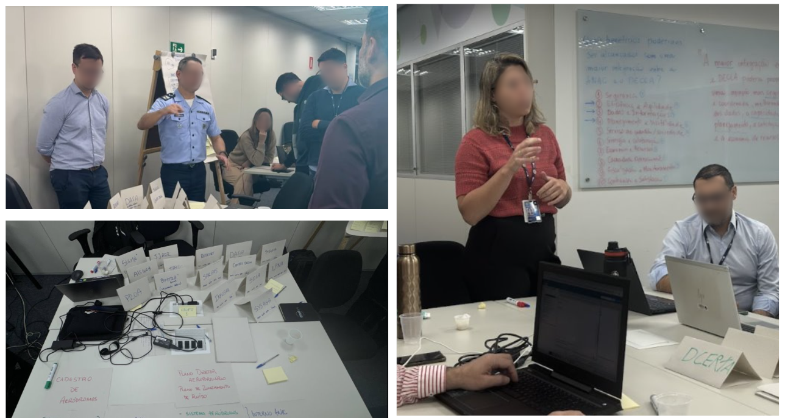
    

        <h4 style="margin: 0; color: #5f6368; font-weight: 400;">ATIVIDADE</h4>
        
A Feira e Caldeirão de Serviços são dinâmicas colaborativas que permitem às equipes explorar, discutir e priorizar serviços de interesse de forma prática e interativa.

         
        
Pertence a seguinte fase do Calliandra:

        Amadurecer
         
         
        <a style="margin: 0; color: #1a73e8; font-weight: 500;" href="../tecnicas-e-ferramentas/feira-caldeirao-servicos">Veja mais</a>
    

 

--------------------------------------------------------
## <a style="color: #1a73e8; font-weight: 500;" href="../tecnicas-e-ferramentas/historiaUsuario">História de usuário</a>

    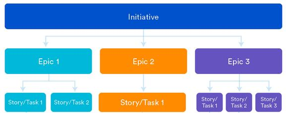
    

        <h4 style="margin: 0; color: #5f6368; font-weight: 400;">TÉCNICA</h4>
        
A história de usuário descreve funcionalidades de um produto pela perspectiva do usuário, ajudando as equipes a entender as necessidades dos clientes e alinhando o desenvolvimento com seus objetivos.

         
        
Pertence a seguinte fase do Calliandra:

        Brotar
         
         
        <a style="margin: 0; color: #1a73e8; font-weight: 500;" href="../tecnicas-e-ferramentas/historiaUsuario">Veja mais</a>
    

 

--------------------------------------------------------
## <a style="color: #1a73e8; font-weight: 500;" href="../tecnicas-e-ferramentas/hipoteseDoNegocioParaMVP">Hipótese do Negócio para o MVP</a>

    
    

        <h4 style="margin: 0; color: #5f6368; font-weight: 400;">ATIVIDADE</h4>
        
A Hipótese do Negócio para o MVP valida suposições sobre o sucesso de um produto, definindo expectativas e métricas para validar essas hipóteses facilitando o aprendizado baseado em dados reais.

         
        
Pertence a seguinte fase do Calliandra:

        Brotar
        Florescer
         
         
        <a style="margin: 0; color: #1a73e8; font-weight: 500;" href="../tecnicas-e-ferramentas/hipoteseDoNegocioParaMVP">Veja mais</a>
    

  

--------------------------------------------------------
## <a style="color: #1a73e8; font-weight: 500;" href="../tecnicas-e-ferramentas/JornadaDoUsuario">Jornada do Usuário</a>

    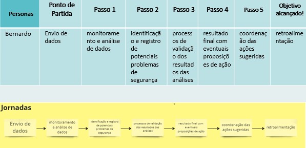
    

        <h4 style="margin: 0; color: #5f6368; font-weight: 400;">TÉCNICA</h4>
        
A jornada do usuário mapeia a experiência do usuário com um produto, desde a descoberta até a fidelização, ajudando a identificar pontos de dor e oportunidades de melhoria.

         
        
Pertence a seguinte fase do Calliandra:

        Brotar
         
         
        <a style="margin: 0; color: #1a73e8; font-weight: 500;" href="../tecnicas-e-ferramentas/JornadaDoUsuario">Veja mais</a>
    

 

--------------------------------------------------------
## <a style="color: #1a73e8; font-weight: 500;" href="../tecnicas-e-ferramentas/disneyAdaptado">Metodologia Disney</a>

    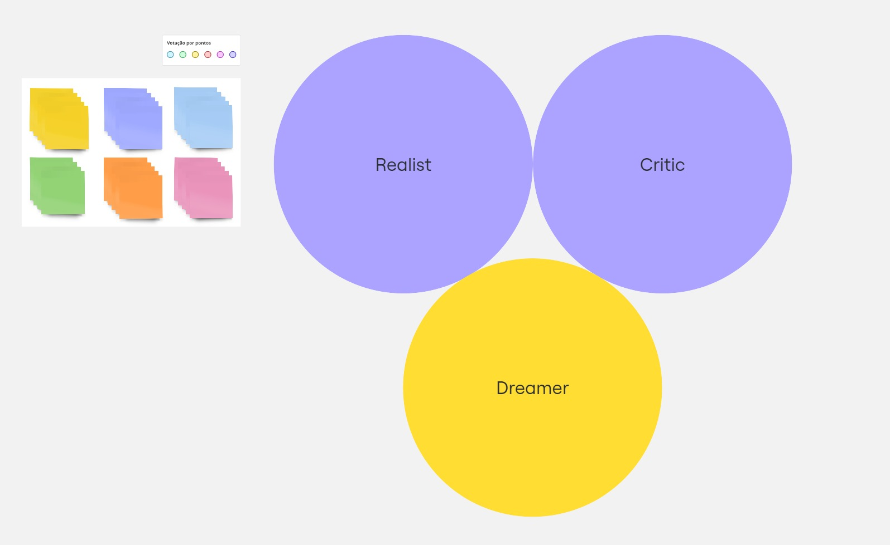
    

        <h4 style="margin: 0; color: #5f6368; font-weight: 400;">METODOLOGIA</h4>
        
A Metodologia Disney é uma abordagem estruturada que promove criatividade e inovação por meio de três perspectivas, focando na exploração criativa, planejamento realista e crítica construtiva para transformar ideias em planos viáveis.

         
        
Pertence a seguinte fase do Calliandra:

        Não possui
         
         
        <a style="margin: 0; color: #1a73e8; font-weight: 500;" href="../tecnicas-e-ferramentas/disneyAdaptado">Veja mais</a>
    

 

--------------------------------------------------------
## <a style="color: #1a73e8; font-weight: 500;" href="../tecnicas-e-ferramentas/matrizIPA">Modelo de Matriz de Impacto e Esforço</a>

    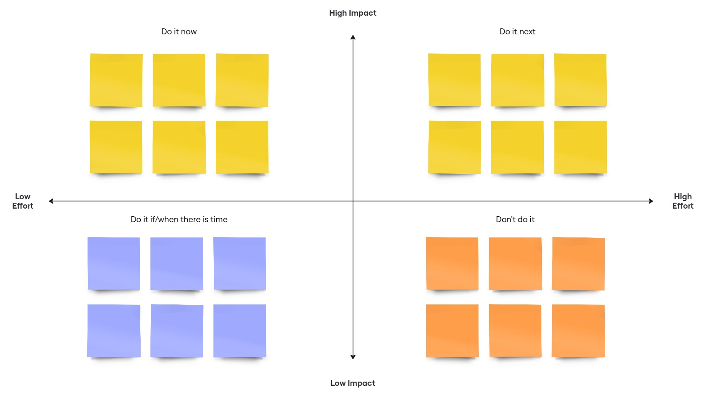
    

        <h4 style="margin: 0; color: #5f6368; font-weight: 400;">FERRAMENTA</h4>
        
A Matriz de Impacto e Esforço é uma ferramenta visual que ajuda equipes a priorizar tarefas, classificando-as pelo impacto nos objetivos e pelo esforço necessário. Ela visa otimizar a gestão de projetos e minimizar perdas de tempo e recursos.

         
        
Pertence a seguinte fase do Calliandra:

        Não possui
         
         
        <a style="margin: 0; color: #1a73e8; font-weight: 500;" href="../tecnicas-e-ferramentas/matrizIPA">Veja mais</a>
    

 

--------------------------------------------------------
## <a style="color: #1a73e8; font-weight: 500;" href="../tecnicas-e-ferramentas/personas">Personas</a>

    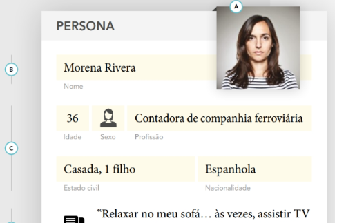
    

        <h4 style="margin: 0; color: #5f6368; font-weight: 400;">TÉCNICA</h4>
        
A persona é uma representação fictícia que reflete as necessidades de um grupo específico de usuários, baseada em dados reais. Essa técnica ajuda a equipe do projeto a entender os desafios dos usuários, promovendo soluções mais eficazes.

         
        
Pertence a seguinte fase do Calliandra:

        Brotar
         
         
        <a style="margin: 0; color: #1a73e8; font-weight: 500;" href="../tecnicas-e-ferramentas/personas">Veja mais</a>
    

  

--------------------------------------------------------
## <a style="color: #1a73e8; font-weight: 500;" href="../tecnicas-e-ferramentas/PropostaMVP">Proposta do MVP</a>

    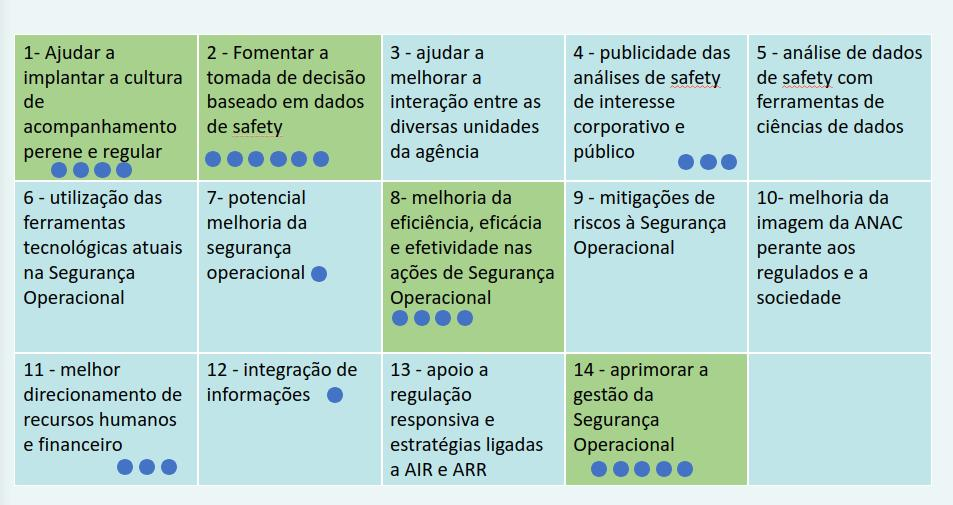
    

        <h4 style="margin: 0; color: #5f6368; font-weight: 400;">ATIVIDADE</h4>
        
A proposta do MVP no "Report Safety" focou em definir as funcionalidades essenciais do produto, ajudando a equipe a entender o que era realmente importante antes de criar a hipótese de negócio e desenvolver o canvas MVP.

         
        
Pertence a seguinte fase do Calliandra:

        Brotar
         
         
        <a style="margin: 0; color: #1a73e8; font-weight: 500;" href="../tecnicas-e-ferramentas/PropostaMVP">Veja mais</a>
    

 

--------------------------------------------------------
## <a style="color: #1a73e8; font-weight: 500;" href="../tecnicas-e-ferramentas/quebra-gelo">Quebra-Gelo</a>

    
    

        <h4 style="margin: 0; color: #5f6368; font-weight: 400;">TÉCNICA</h4>
        
O quebra-gelo é uma técnica que promove a interação entre os participantes de um grupo, especialmente em oficinas e eventos colaborativos. Seu objetivo é criar um ambiente descontraído, permitindo que todos se sintam mais à vontade para se conhecer e compartilhar ideias.

         
        
Pertence a seguinte fase do Calliandra:

        Não possui
         
         
        <a style="margin: 0; color: #1a73e8; font-weight: 500;" href="../tecnicas-e-ferramentas/quebra-gelo">Veja mais</a>
    

  

--------------------------------------------------------
## <a style="color: #1a73e8; font-weight: 500;" href="../tecnicas-e-ferramentas/Roadmap">Roadmap</a>

    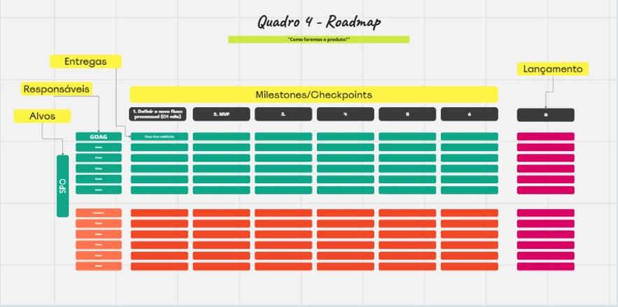
    

        <h4 style="margin: 0; color: #5f6368; font-weight: 400;">TÉCNICA</h4>
        
O roadmap de produto comunica a visão e o progresso do produto, alinhando a equipe e stakeholders em torno das metas, funcionalidades e prioridades, permitindo ajustes no planejamento.

         
        
Pertence a seguinte fase do Calliandra:

        Amadurecer
         
         
        <a style="margin: 0; color: #1a73e8; font-weight: 500;" href="../tecnicas-e-ferramentas/Roadmap">Veja mais</a>
    

 

--------------------------------------------------------
## <a style="color: #1a73e8; font-weight: 500;" href="../tecnicas-e-ferramentas/storyboard">Storyboard</a>

    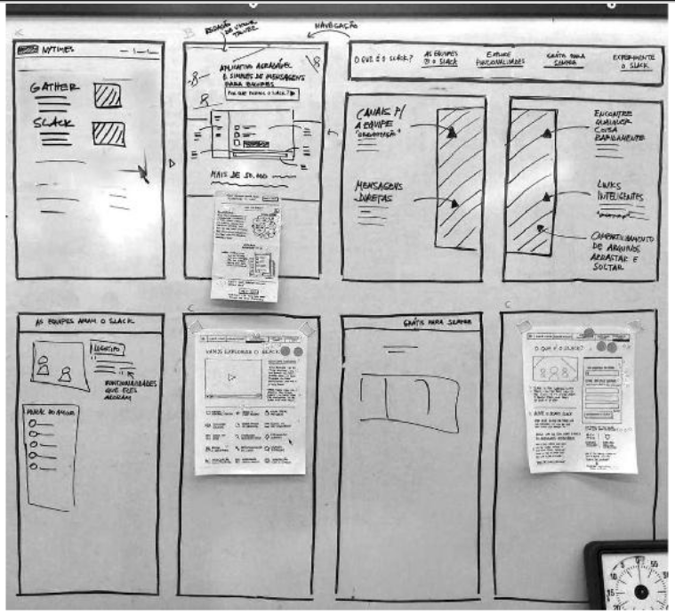
    

        <h4 style="margin: 0; color: #5f6368; font-weight: 400;">TÉCNICA</h4>
        
O storyboard é uma técnica que transforma ideias em uma narrativa visual, facilitando o planejamento e a comunicação. Ele organiza as etapas do projeto, permitindo que as equipes visualizem o fluxo do usuário e identifiquem melhorias antes da criação do protótipo.

         
        
Pertence a seguinte fase do Calliandra:

        Florescer
         
         
        <a style="margin: 0; color: #1a73e8; font-weight: 500;" href="../tecnicas-e-ferramentas/storyboard">Veja mais</a>
    

  

--------------------------------------------------------
## <a style="color: #1a73e8; font-weight: 500;" href="../tecnicas-e-ferramentas/testesComUsuarios">Testes com Usuários</a>

    
    

        <h4 style="margin: 0; color: #5f6368; font-weight: 400;">TÉCNICA</h4>
        
Os testes com usuários são essenciais para aprimorar produtos, permitindo entender como interagem com protótipos e identificar problemas e melhorias, garantindo que atendam às necessidades reais dos usuários.

         
        
Pertence a seguinte fase do Calliandra:

        Geminar
        Florescer
         
         
        <a style="margin: 0; color: #1a73e8; font-weight: 500;" href="../tecnicas-e-ferramentas/testesComUsuarios">Veja mais</a>
    

 

--------------------------------------------------------
## <a style="color: #1a73e8; font-weight: 500;" href="../tecnicas-e-ferramentas/visaoDoProduto">Visão do Produto</a>

    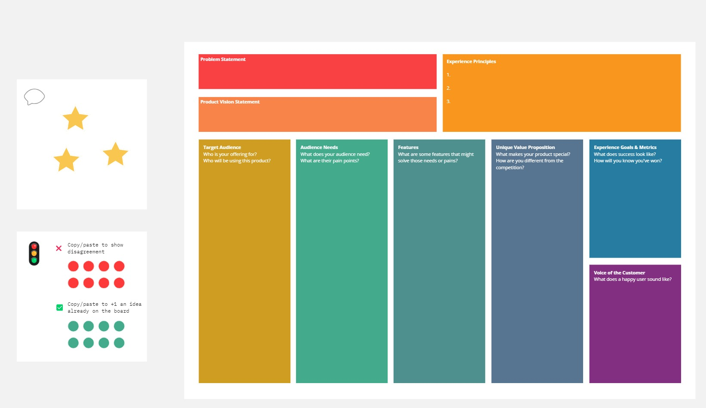
    

        <h4 style="margin: 0; color: #5f6368; font-weight: 400;">FERRAMENTA</h4>
        
A Visão do Produto é uma ferramenta estratégica que define e comunica a essência do produto, alinhando a equipe em torno de um objetivo comum e focando nas necessidades do mercado e dos usuários.

         
        
Pertence a seguinte fase do Calliandra:

        Geminar
        Brotar
         
         
        <a style="margin: 0; color: #1a73e8; font-weight: 500;" href="../tecnicas-e-ferramentas/visaoDoProduto">Veja mais</a>
    

 

--------------------------------------------------------
## <a style="color: #1a73e8; font-weight: 500;" href="../tecnicas-e-ferramentas/wireframe">Wireframes</a>

    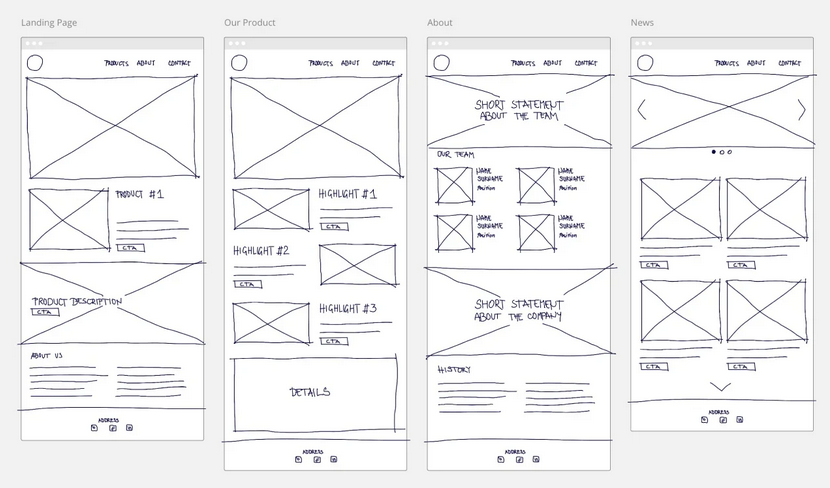
    

        <h4 style="margin: 0; color: #5f6368; font-weight: 400;">TÉCNICA</h4>
        
Wireframes é uma técnica que ilustra a estrutura de interfaces digitais, funcionando como um ponto de partida para o design. Eles priorizam a estrutura, facilitando a criação e a colaboração entre os profissionais.

         
        
Pertence a seguinte fase do Calliandra:

        Florescer
         
         
        <a style="margin: 0; color: #1a73e8; font-weight: 500;" href="../tecnicas-e-ferramentas/wireframe">Veja mais</a>
    

--------------------------------------------------------
## <a style="color: #1a73e8; font-weight: 500;" href="../tecnicas-e-ferramentas/worldCafe">World Café</a>

    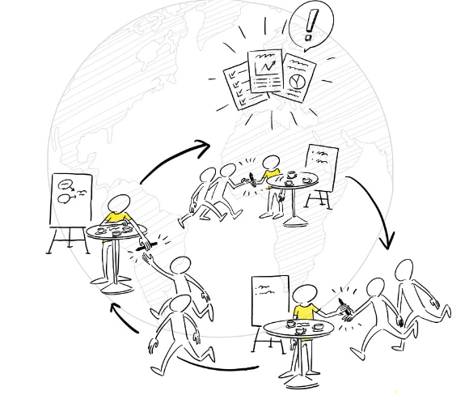
    

        <h4 style="margin: 0; color: #5f6368; font-weight: 400;">TÉCNICA</h4>
        
O World Café é uma técnica que facilita conversas em grupo de forma descontraída, onde participantes discutem questões importantes em pequenos grupos, promovendo colaboração e solução conjunta de problemas.

         
        
Pertence a seguinte fase do Calliandra:

        Semear
         
         
        <a style="margin: 0; color: #1a73e8; font-weight: 500;" href="../tecnicas-e-ferramentas/worldCafe">Veja mais</a>
    

 
