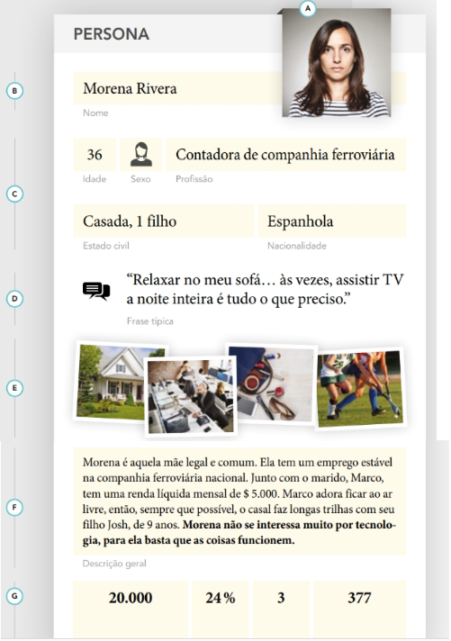

# Personas

A persona é uma técnica que ajuda a garantir que todos os envolvidos em um projeto entendam melhor as necessidades dos usuários. Uma persona é um perfil fictício que representa um grupo específico de pessoas com características e necessidades semelhantes. Essas características geralmente são baseadas em pesquisas reais e dados de comportamento. Persona não é um estereótipo e sim um exemplar que ajuda a refletir as necessidades, motivações e desafios de uma pessoa particular, como clientes, usuários ou funcionários.

As personas são importantes porque ajudam as equipes e organizações a entender e a se colocar no lugar dos usuários finais, facilitando no alinhamento de expectativas e a nas soluções. Além disso, servem como referência durante o desenvolvimento de produtos ou serviços, garantindo que as decisões sejam feitas com o usuário em mente evitando suposições erradas. Vale ressaltar que, segundo Hazel White, uma persona com base sólida, tem validade de mais ou menos 12 meses, passando desse prazo, é preciso que seja desenvolvido outra persona.

---

# Quando usá-la?

A técnica de personas é particularmente útil quando se deseja criar ou melhorar produtos, serviços ou experiências centradas no usuário. Ela é frequentemente utilizada em fases iniciais de projetos de design de experiência do usuário (UX), desenvolvimento de produtos e campanhas de marketing. Usar personas ajuda a alinhar os esforços de uma equipe multidisciplinar em torno das necessidades reais dos usuários, garantindo que todos compreendam para quem estão desenvolvendo soluções.

Segundo Stickdorn e Lawrence (2019), a técnica é relevante em projetos de design de serviços, onde é importante entender não apenas as necessidades, mas também os comportamentos, expectativas e dores dos usuários em diferentes pontos de contato. Personas também são valiosas em fases de teste e validação.

---

# A técnica na prática

A criação de personas envolve a coleta de informações diretamente dos usuários e stakeholders por meio de entrevistas, observações e pesquisas, como destacado por Stickdorn et al. (2019). Essa técnica permite identificar padrões comportamentais, necessidades, motivações e frustrações, que são posteriormente organizados em perfis representativos. Esses perfis, conhecidos como personas, auxiliam no desenvolvimento de soluções mais precisas e centradas nos usuários, garantindo que o foco do projeto esteja em resolver problemas reais.

Segundo Stickdorn et al. (2019), uma persona completa também pode conter uma citação que resume o estado de espírito ou a perspectiva do usuário em relação ao serviço ou produto. Na imagem 1, demonstra os elementos característicos que se tem presente em uma persona:

<h6 align="center">Imagem 1 - Exemplo de Persona.</h6>

<h6 align="center">Fonte: STICKDORN; LAWRENCE; MARKUS, 2019, p. 41 e 42. Design de Serviço na Prática</a></h6>

Explicação da estrutura para a construção da persona:

**A) Retrato:** Imagem ou foto representativa da persona, podendo ser um esboço ou fotografia neutra para evitar estereótipos e aumentar a autenticidade. A imagem deve refletir atributos e comportamentos comuns à persona.

**B) Nome:** Nome que representa a persona, frequentemente acompanhado de um subtítulo arquetípico. O nome ajuda a contextualizar o ambiente social e o contexto da persona.

**C) Demografia:** Informações como idade, gênero e localização que contextualizam a persona. Deve ser usado com cuidado para evitar estereótipos e pressuposições enganosas sobre gostos e comportamentos.

**D) Citação:** Uma frase que captura a atitude ou a perspectiva principal da persona, facilitando a memorização e a conexão rápida da equipe com a persona.

**E) Imagens de Inspiração:** Fotografias ou esboços que fornecem contexto adicional sobre a persona, ilustrando o ambiente, padrões de comportamento e itens importantes para a persona.

**F) Descrição:** Detalhes sobre a persona, incluindo histórias contextuais, características, personalidade, interesses, habilidades, necessidades, expectativas, motivações, objetivos e frustrações. Deve ser relevante para o desafio de design ou pesquisa.

**G) Estatística:** Dados quantitativos que fornecem informações relevantes sobre a persona, ajudando a corroborar descrições qualitativas e aumentar a confiabilidade da persona em contextos de gestão ou marketing.

---

# O que a técnica agrega na oficina

A utilização da técnica personas em oficinas, permiti que os participantes pensem de forma centrada no usuário, proporcionando um entendimento mais aprofundado das pessoas para as quais estão projetando ou desenvolvendo soluções. Isso cria um ambiente de empatia e colaboração, em que as decisões são baseadas em dados e comportamentos reais, ao invés de suposições.

Personas também ajudam a alinhar a equipe em torno de um objetivo comum, facilitando a tomada de decisões mais informadas e eficazes. Como observado por Stickdorn et al. (2019), a técnica de personas promove um entendimento compartilhado entre os membros da equipe sobre quem é o usuário e quais são suas necessidades, motivações e desafios, tornando o processo de co-criação mais produtivo e direcionado.

---

# Bibliografia

1. STICKDORN, M.; HORMESS, M. E.; LAWRENCE, A.; SCHNEIDER, J. Isto é design de serviço na prática: como aplicar o design de serviço no mundo real – manual do praticante. Rio de Janeiro: Alta Books, 2019.