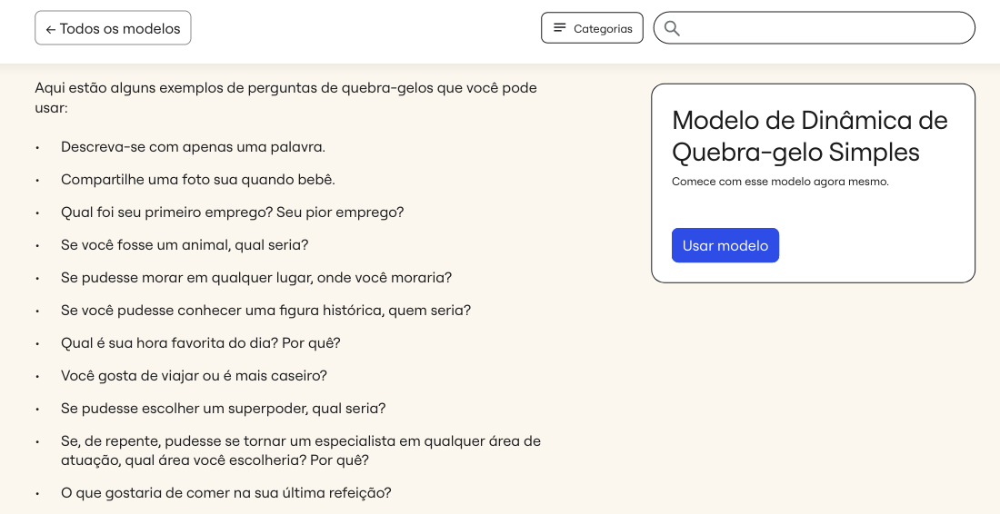
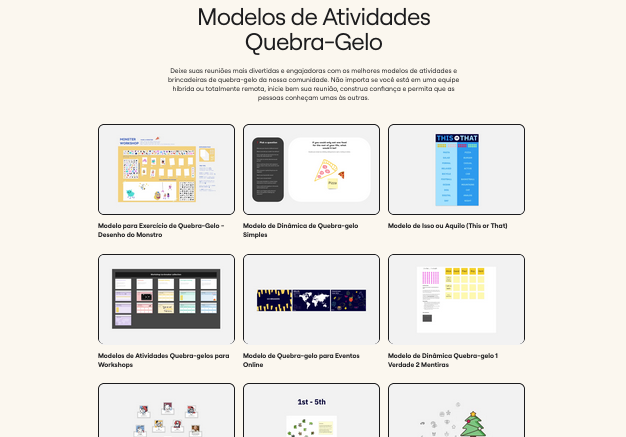

# Quebra-Gelo

O quebra-gelo é uma técnica usada para facilitar a interação e a comunicação entre os participantes de um grupo, principalmente em contextos de trabalho colaborativo ou eventos em grupo como oficinas. O objetivo é criar um ambiente mais descontraído e confortável, ajudando os participantes a se conhecerem melhor e a se sentirem mais à vontade para colaborar e compartilhar ideias.

---

# Quando usá-la?

A técnica de quebra-gelo é utilizada em situações onde os participantes de um grupo não se conhecem bem ou estão se encontrando pela primeira vez. Também é eficaz em eventos de treinamento, workshops ou reuniões em que a interação entre os membros é essencial para o sucesso das atividades. 

Conforme abordado por Brennan (2019), atividades de quebra-gelo são indicadas em contextos onde a confiança e o engajamento entre os membros do grupo precisam ser estimulados, como em oficinas. Nessas situações, a técnica facilita a troca de ideias e um ambiente mais colaborativo.

---

# A técnica na prática

O quebra-gelo geralmente começa com atividades que incentivam os participantes a compartilhar algo pessoal ou interessante sobre si mesmos, como suas preferências ou experiências. Essas atividades podem ser jogos, perguntas ou exercícios colaborativos que ajudam a romper barreiras iniciais como a tensão, e estimular a interação entre os participantes. 

Um exemplo prático é o uso de perguntas divertidas ou reflexivas que incentivam os participantes a compartilharem algo pessoal, trazendo o autoconhecimento e o conhecimento do outro. Outra forma é a divisão dos participantes em pequenos grupos para que colaborem em uma tarefa simples, como a construção de algo simbólico.

<h6 align="center">Imagem 1 - Exemplos de Perguntas para o quebra-gelo.</h6>

<h6 align="center">Fonte: Miro. 2024.</a></h6>

  
<h6 align="center">Imagem 2 - modelos para o quebra-gelo.
</h6>

<h6 align="center">Fonte: Miro. 2024.</a></h6>

No site do Miro, você pode encontrar uma variedade de ideias de perguntas e também de modelos interativos para aplicar a técnica do quebra-gelo. As imagens 1 e 2 demonstram as páginas de modelos de template e de perguntas. Para acessar esses materiais, clique nos links abaixo:

Para acessar o modelo de perguntas: **[Link_para_Perguntas](https://miro.com/pt/modelos/dinamica-quebra-gelo-simples/)**

Para acessar o modelo de template: **[Link_para_Modelos](https://miro.com/pt/modelos/brincadeiras-quebra-gelo/)**

---

# O que a técnica agrega na oficina

A utilização da técnica de quebra-gelo em oficinas traz uma série de benefícios. Primeiramente, ela contribui para criar um ambiente acolhedor, onde os participantes se sentem mais confortáveis em expressar suas opiniões e colaborar uns com os outros. Além disso, ao incentivar a interação inicial entre os participantes, a técnica ajuda a quebrar barreiras sociais e culturais, o que pode melhorar a dinâmica do grupo durante a oficina.

Segundo Roberts (2021), as atividades de quebra-gelo são essenciais para promover a socialização entre os participantes, facilitando um ambiente de confiança e comunicação aberta. Roberts afirma que a eficácia dessas técnicas está na capacidade de construir rapidamente uma sensação de pertencimento e engajamento, o que é crucial para a colaboração em ambientes de trabalho e de aprendizagem. Além disso, as atividades podem ser adaptadas para diversos contextos, desde eventos corporativos até oficinas educativas, tornando-as uma ferramenta versátil.

---

# Bibliografia

1. BRENNAN, M. *Facilitating group dynamics: breaking the ice effectively*. New York: Workshop Press, 2019.
2. ROBERTS, A. Engaging participants: using icebreakers to build group cohesion in collaborative settings. *Workshop Innovations Journal*, v. 8, n. 2, p. 45-58, 2021.
3. MIRO. Quebra-gelo: reunião de trabalho. Disponível em: https://miro.com/pt/modelos/quebra-gelo-reuniao-trabalho/. Acesso em: 09 set. 2024.