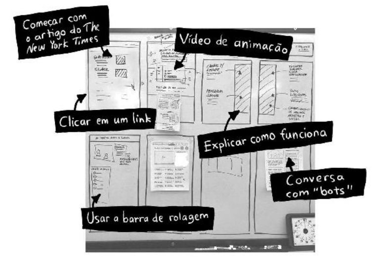
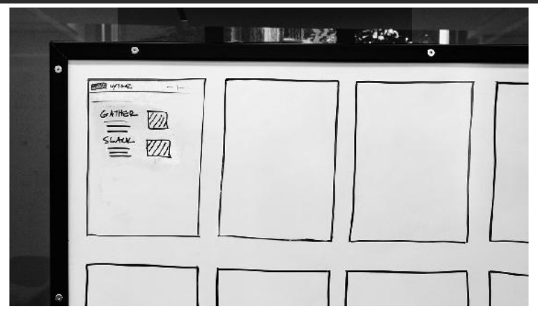
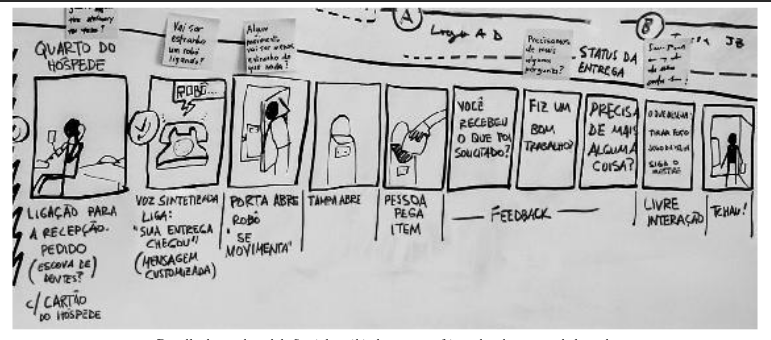

# Storyboard

O storyboard é uma ferramenta essencial no desenvolvimento de produtos e soluções, especialmente em oficinas de inovação. Ele ajuda a transformar ideias em uma narrativa visual, facilitando o planejamento e a comunicação entre equipes. Na prática, o storyboard organiza as principais etapas de um projeto, possibilitando que as equipes visualizem o fluxo completo da experiência do usuário. Isso permite identificar falhas e melhorar a coesão da solução antes mesmo de começar a implementação do protótipo.

<b>Figura 1</b> - Estrutura de um storyboard

<b>Fonte: </b>Levy, Jaime. Estratégia de UX: Técnicas de Estratégia de Produto para Criar Soluções Digitais Inovadoras. O'Reilly Media, 2ª Edição, 2020.

---

# Quando usá-la?

O storyboard é utilizado quando a equipe precisa definir, de maneira clara e sequencial, o que será apresentado no protótipo ou no teste de um produto com usuários. Ele é especialmente valioso em momentos críticos, como o desenvolvimento de um protótipo em sprints rápidos. Ao usar um storyboard, a equipe evita problemas de planejamento e garante que todos estejam alinhados com o que será entregue.

A técnica é recomendada para:

- Desenvolvimento de protótipos para testes com usuários.
- Planejamento de soluções que envolvem múltiplas etapas.
- Visualizar a interação do usuário com o produto, serviço ou experiência.
- Evitar retrabalho e tomadas de decisões tardias durante a criação.

<b>Figura 2</b> - Planejamento de interação de usuário com o produto

<b>Fonte: </b>Levy, Jaime. Estratégia de UX: Técnicas de Estratégia de Produto para Criar Soluções Digitais Inovadoras. O'Reilly Media, 2ª Edição, 2020.

---

# A técnica na prática

Para colocar a técnica do storyboard em prática, é necessário que a equipe siga alguns passos:

1. **Desenhe os painéis:** Comece desenhando cerca de 10 a 15 quadros em uma grande superfície (como um quadro branco). Eles devem ter o tamanho aproximado de duas folhas A4.
2. **Escolha a cena de abertura:** A primeira cena deve ser o ponto de entrada do usuário. Se for um produto digital, pode ser uma página de loja de aplicativos; se for um produto físico, pode ser uma prateleira em um supermercado. A escolha da cena inicial é crucial, pois ela cria o contexto para o teste.
3. **Preencha os painéis com ações do usuário:** Cada quadrado deve representar uma ação ou etapa que o usuário tomará. Use notas adesivas ou esboços dos elementos principais para preencher esses quadros.
4. **Trabalhe com o que já foi decidido:** Não é o momento de criar novas ideias ou soluções. O foco deve ser em organizar o que já foi definido para que a equipe possa se concentrar na montagem do protótipo.
5. **Limite o storyboard a 15 minutos de teste:** Isso ajuda a focar nas partes mais importantes do protótipo e garante que o teste será eficiente.

<b>Figura 3</b> - Sequência de etapas para desenvolvimento de protótipo

<b>Fonte: </b>Levy, Jaime. Estratégia de UX: Técnicas de Estratégia de Produto para Criar Soluções Digitais Inovadoras. O'Reilly Media, 2ª Edição, 2020.

---

# O que a técnica agrega na oficina

O uso do storyboard agrega inúmeros benefícios à dinâmica de uma oficina:

- **Clareza e alinhamento:** O storyboard garante que todos os membros da equipe compreendam a sequência de interações e a visão final do produto.
- **Tomada de decisões antecipadas:** Decisões importantes são tomadas com antecedência, permitindo que o foco da equipe durante a construção do protótipo seja nas partes operacionais e nos detalhes finos.
- **Economia de tempo e energia:** A técnica ajuda a evitar debates longos sobre detalhes pequenos, concentrando a energia da equipe na execução. Isso é fundamental em sprints rápidos, onde a fadiga de decisão pode ser um problema.
- **Facilidade de comunicação:** Storyboards são uma excelente ferramenta de comunicação, facilitando o compartilhamento de ideias e soluções com stakeholders ou outros membros da equipe de maneira visual e objetiva.

<b>Figura 3</b> - Exemplo de storyboard consolidado

<b>Fonte: </b>Levy, Jaime. Estratégia de UX: Técnicas de Estratégia de Produto para Criar Soluções Digitais Inovadoras. O'Reilly Media, 2ª Edição, 2020.

---

# Bibliografia

1. Knapp, Jake. *Sprint: O Método Usado no Google para Testar e Aplicar Novas Ideias em Apenas Cinco Dias*. Intrínseca, 2016.
2. Levy, Jaime. *Estratégia de UX: Técnicas de Estratégia de Produto para Criar Soluções Digitais Inovadoras*. O'Reilly Media, 2ª Edição, 2020.