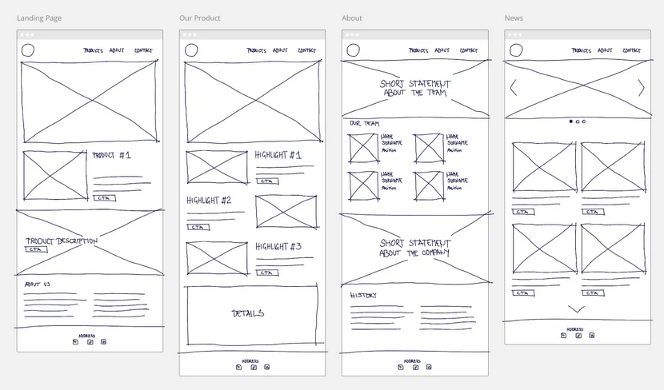

# Wireframes

Wireframes é uma técnica que consistem em esquemas de interfaces digitais que mostram como suas estruturas funcionam e se encadeiam, com o objetivo de criar um ponto de partida para a equipe de design. Segundo Stickdorn et al. (2019), a maioria dos elementos dos wireframes é estrutural e mais sugerida do que explícita, o que acelera sua criação e exige habilidades menos especializadas. Os wireframes são frequentemente utilizados para alinhar diferentes disciplinas dentro de uma equipe de projeto, mapear as jornadas de usuário ou atuar como ponto de partida para protótipos de papel ou modelos interativos clicáveis.

---

# Quando usá-la?

É importante entender antes a diferença entre um protótipo e um wireframe. O protótipo é um passo além, pois é mais detalhado e interativo, os usuários podem sentir o fluxo e os recursos, assim como no produto real. Um wireframe não é tão avançado, ele apenas define onde diferentes elementos serão localizados, sem mergulhar em detalhes visuais ou funcionais. 

Os wireframes são uma ferramenta essencial nas fases iniciais do design de serviços, conforme descrito por Stickdorn et al. (2019). Eles devem ser utilizados quando a equipe precisa estruturar e visualizar a interface digital antes de entrar em detalhes estéticos. Durante essa fase, o foco é na organização da informação e na definição clara de como os elementos da interface se relacionam. Isso proporciona uma base sólida para o desenvolvimento do projeto.

É importante usar wireframes quando se busca o alinhamento entre as diferentes disciplinas envolvidas no projeto. Ao criar uma representação visual, todos os membros da equipe, como designers, desenvolvedores e stakeholders, podem ter um entendimento compartilhado do que está sendo planejado. Essa clareza de comunicação é crucial para garantir que todos estejam na mesma página e trabalhem em direção a um objetivo comum.

Além disso, os wireframes são extremamente úteis para mapear as jornadas dos usuários. Eles ajudam a identificar como os usuários interagem com o sistema, permitindo que a equipe antecipe e resolva possíveis problemas de usabilidade. Esse mapeamento é fundamental para garantir que a experiência do usuário seja intuitiva e atenda às suas necessidades.

Os wireframes também servem como ponto de partida para protótipos de papel ou interativos. Essa abordagem permite que a equipe teste suas ideias rapidamente e faça ajustes com base no feedback, evitando assim investimentos desnecessários em detalhes visuais antes de validar a estrutura e a funcionalidade.

---

# A técnica na prática

Quando se trata de colocar os wireframes em prática, Stickdorn et al. (2019) sugerem um processo em três etapas. A primeira etapa é a preparação, que começa com esboços em papel, quadros brancos ou aplicativos específicos. Nessa fase, a ideia é deixar de lado elementos gráficos, como cores e fontes, focando na organização e no layout da interface. É importante reservar espaço para o conteúdo que será adicionado posteriormente.

O excalidraw, figma e o miro são exemplos de ferramentas para desenvolver os wireframes de forma digital. O excalidraw é mais simples de desenvolver do que os outros citados. Para acessá-los clique nos links logo abaixo:

Para acessar o Excalidraw: **[Link_excalidraw](https://excalidraw.com/)**

Para acessar o Figma:**[Link_figma](https://www.figma.com/pt-br/?gad_source=1&gclid=Cj0KCQjwxsm3BhDrARIsAMtVz6NcZfXVexkAwqZogSTYGfDy8Zmqxz3I-VxUzrzWzeJA5sJilF3IG1YaAkgsEALw_wcB)**

Para acessar o Miro: **[Link_miro](https://miro.com/pt/)**

A segunda etapa é a aplicação dos wireframes. Após a criação, os wireframes podem ser exibidos em uma parede, permitindo que a equipe discuta e refine as ideias em conjunto. Anotações são adicionadas para registrar os comportamentos esperados dos elementos de interface e detalhes sobre o contexto de uso.

Por fim, a terceira etapa envolve a utilização de técnicas de pesquisa. Para validar as ideias apresentadas nos wireframes, é fundamental aplicar métodos como workshops de cocriação, entrevistas e testes de conceito. Essas técnicas ajudam a coletar feedback valioso, garantindo que as soluções propostas atendam às necessidades dos usuários de forma eficaz.

Na imagem 1, demonstra como é um exemplo de wireframes:

<h6 align="center">Tabela 1 - exemplo de wireframes.</h6>

<h6 align="center">Fonte: Miro. 2024.</a></h6>

---

# O que a Técnica Agrega na Oficina

Utilizar wireframes em oficinas de design traz benefícios significativos. Eles proporcionam um alinhamento claro entre as visões da equipe, facilitando o consenso em torno das necessidades do projeto. Além disso, a possibilidade de fazer ajustes rapidamente durante as discussões permite uma iteração ágil, minimizando o impacto no cronograma.

Os wireframes também ajudam a identificar problemas de usabilidade ou fluxo logo no início do processo, antes que se dediquem muitos recursos a protótipos mais detalhados. O resultado dessa abordagem inclui a coleta de dados valiosos, como erros, insights e novas ideias, além de vídeos e anotações que documentam o progresso da equipe.

---

# Bibliografia

1. STICKDORN, Marc; LAWRENCE, Adam; HORMESS, Markus; et al. Isto é design de serviço na prática: como aplicar o design de serviço no mundo real: manual do praticante. Porto Alegre: Bookman, 2019. E-book. ISBN 9788582605288. Disponível em: Minha Biblioteca. Acesso em: 24 set. 2024.
2. MIRO. O que é wireframe? Disponível em: <https://miro.com/pt/wireframe/o-que-e-wireframe/>. Acesso em: 24 set. 2024.

